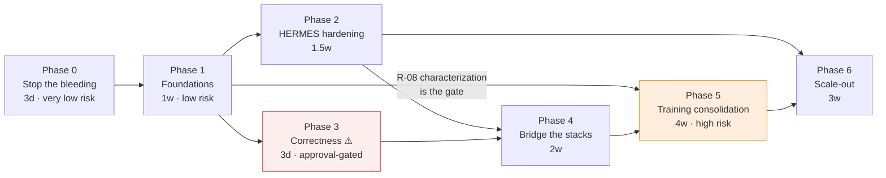

# HiFINS — Refactoring Strategy

**Status:** Proposal. Requires approval before any code change.
**Date:** 2026-08-10 · **Baseline:** `main` @ `35e2eeb`
**Inputs:** [`00_Critical_Problem_Areas.md`](00_Critical_Problem_Areas.md) ·
[architecture review](../architecture%20documents/System_Architecture_Overview.md)

---

## 1. Principles for this refactor

These constrain every item below. If a proposed change violates one, it is out of scope.

1. **No functional change without explicit approval.** Two items ([R-14](#r-14),
   [R-15](#r-15)) alter observable behaviour. Both are isolated, flagged, and have a
   behaviour-preserving variant. Everything else must produce byte-identical results.
2. **Do not rewrite `hermes/`.** It is the best code here, it has 512 passing tests, and
   its abstractions are the right ones. Harden it in place; extend it through the
   Protocols it already defines.
3. **Tests before structure.** `Config/ModelTrainingConfig/` has zero test coverage and
   21.3 K LOC. Consolidating it without a characterization harness first is not a
   refactor, it is a rewrite with extra steps.
4. **Sequence by unblocking, not by severity.** Packaging is P1 but comes first, because
   it is the precondition for splitting requirements, registering pytest markers, and
   removing `sys.path` hacks.
5. **Every step ships independently.** No phase depends on a later phase. Stopping after
   any phase leaves the repository better than it started.
6. **Preserve the fix-provenance comments.** The `H1` / `S2-M3` / `L-H2` / `EX-4.2` tags
   are load-bearing institutional memory. Carry them through any move.

---

## 2. Phase plan

| Phase | Theme | Items | Effort | Risk | Unblocks |
|---|---|---|---|---|---|
| **0** | Stop the bleeding | R-01 … R-05 | ~3 days | Very low | Deployment, honest docs |
| **1** | Foundations | R-06 … R-09 | ~1 week | Low | Everything downstream |
| **2** | HERMES hardening | R-10 … R-13 | ~1.5 weeks | Low–Medium | Real missions, scale |
| **3** | Correctness (approval-gated) | R-14 … R-16 | ~3 days | **Behaviour-changing** | Valid hyperparameter sweeps |
| **4** | Bridge the stacks | R-17 … R-18 | ~2 weeks | Medium | Actual GAN-in-HERMES |
| **5** | Training-stack consolidation | R-19 … R-22 | ~4 weeks | **High** | 21.3 K → ~4 K LOC |
| **6** | Scale-out | R-23 … R-26 | ~3 weeks | Medium | 10× topology |

Total ≈ 13 weeks of focused effort. Phases 0–2 (≈3 weeks) capture most of the risk
reduction; phase 5 is the largest and should not start until phase 1's characterization
harness exists.

---

## Phase 0 — Stop the bleeding (~3 days, very low risk)

Documentation and configuration only. No source file changes. Ship as one PR.

### R-01 — Make the README truthful {#r-01}

Fixes the documentation half of [C-03](00_Critical_Problem_Areas.md#c-03),
[A-07](00_Critical_Problem_Areas.md#a-07), [E-01](00_Critical_Problem_Areas.md#e-01),
[A-06](00_Critical_Problem_Areas.md#a-06).

- Mark `--mode hermes` as **not implemented**; point at `python -m hermes.processes.*`
  as the real entry point.
- Remove `pytest.ini` from the repository-layout block (or add the file — see
  [R-06](#r-06)).
- Correct the `FlightFramework/` line: "vendored third-party FLoX; currently unused".
- Correct the test-count claim ("410 passed") to the measured figure, with the
  environment caveat.
- State the working-directory requirement explicitly for every documented command.

**DoD:** every command in the README executes as written from the stated directory, or
is marked as not-yet-working.

### R-02 — Add `LICENSE` {#r-02}

The README declares MIT and links a file that does not exist, while the repository
vendors a third-party MIT project. Add the MIT text with the correct copyright line, and
record `FlightFramework/`'s provenance in a `THIRD_PARTY_NOTICES.md` — or delete it per
[R-05](#r-05).

**DoD:** `LICENSE` exists; every vendored tree's origin and licence is recorded.

### R-03 — Extend `.gitignore` {#r-03}

Fixes [G-01](00_Critical_Problem_Areas.md#g-01).

```gitignore
.claude/
.idea/
.pytest_cache/
.venv*/
*.egg-info/
```

Decide `hermes_rl/`'s fate explicitly: promote to a git submodule, move into the tree as
tracked source, or move out of the repository. Leaving a nested `.git` untracked loses it
on the next clone.

**DoD:** `git status` is clean on a fresh checkout after a full test run; `git add -A`
stages nothing unintended.

### R-04 — Split and repair requirements {#r-04}

Fixes [E-01](00_Critical_Problem_Areas.md#e-01). Replace the 273-line freeze with three
files derived from actual imports:

```
requirements/core.txt      numpy>=1.24,<3        # everything hermes/ needs
requirements/test.txt      -r core.txt + pytest
requirements/ml.txt        -r core.txt + tensorflow==2.15.*, scikit-learn, pandas,
                                          matplotlib, scipy, h5py
requirements/legacy.txt    -r ml.txt   + flwr==1.9.0
```

Remove `uuid`, `zmq`, `serial`, `gps`, `distro-info`, `launchpadlib`, `wadllib`,
`ssh-import-id`, `python-apt`, `PyQt5`, `ansible`, `torch`, `transformers`, `hagrid`,
`syft-proto`, `boto3`, `azure-*` unless a concrete import is found.

**Verification:** `pip install -r requirements/test.txt && pytest tests/unit -q` in a
clean venv must pass without TensorFlow present.

**DoD:** a clean venv installs each tier without error; `tests/unit` passes on
`test.txt` alone.

### R-05 — Delete dead trees {#r-05}

Fixes [A-07](00_Critical_Problem_Areas.md#a-07), [D-02](00_Critical_Problem_Areas.md#d-02).
Each of these has zero importers — verified by repo-wide grep:

| Path | LOC | Evidence |
|---|---|---|
| `FlightFramework/` | 5,853 | zero `import flight` outside itself |
| `Config/…/GAN/FullModel/CANGANCentralTrainingConfig.py` | 1,900 | only reference is a commented-out import |
| `Config/…/CentralTrainingConfig/misc/Copy of ACGANCentralTrainingConfig.py` | ~600 | filename says it |
| `Config/DatasetConfig/CICIOT2023_Sampling/ciciot2023DatasetLoad.py` | 271 | superseded by `…LoadV2`; hardcodes its arguments |
| `Config/DatasetConfig/IOTBotNet2020_Sampling/iotbotnet2020DatasetLoad.py` | 315 | superseded by `…LoadV2` |

**~9 K LOC removed, zero behaviour change.** Git history preserves them; tag the commit
before deletion (`pre-deadcode-removal`) so recovery is one command.

**DoD:** full suite green after deletion; a scripted import of every remaining module
succeeds.

---

## Phase 1 — Foundations (~1 week, low risk)

### R-06 — Add packaging metadata {#r-06}

Fixes [A-06](00_Critical_Problem_Areas.md#a-06). Add `pyproject.toml` declaring
`hermes`, `experiments`, and `Config` as packages, plus `pytest.ini` (or `[tool.pytest]`)
registering the `slow` marker and setting `testpaths`. Reference implementation in
[`HIFINS/HIFINS_Production_Code.md` §1](HIFINS/HIFINS_Production_Code.md#1-packaging).

Then remove all 16 `sys.path.append(os.path.abspath('../../..'))` lines, since
`pip install -e .` makes them unnecessary.

**DoD:** `pip install -e .` succeeds; `pytest` runs from any directory; no
`PytestUnknownMarkWarning`; `--strict-markers` passes.

### R-07 — Repo-anchored path resolution {#r-07}

Fixes [M-02](00_Critical_Problem_Areas.md#m-02). One `hifins/paths.py` resolving the
dataset root from, in order: an explicit argument, `$HIFINS_DATASET_ROOT`,
`$HOME/datasets`, then the legacy `../../../../datasets` for backward compatibility.
Replace the six hardcoded literals with calls to it.

Reference implementation in
[`HIFINS/HIFINS_Production_Code.md` §2](HIFINS/HIFINS_Production_Code.md#2-path-resolution).

**Behaviour preservation:** the legacy relative path stays last in the resolution order,
so an existing run from `App/TrainingApp/Client/` finds exactly the same directory.

**DoD:** training runs identically from the repository root and from
`App/TrainingApp/Client/`; a missing dataset raises a clear error naming every path
tried, instead of `FileNotFoundError` on a mangled relative path.

### R-08 — Characterization harness for the training stack {#r-08}

**This is the precondition for phase 5 and the highest-value item in phase 1.**

`Config/ModelTrainingConfig/` has zero tests. Before consolidating 47 classes, capture
what they currently do:

1. A tiny synthetic dataset fixture (200 rows, correct schema, fixed seed).
2. For each live trainer class: construct → `fit` for 1 epoch with a fixed seed →
   snapshot the resulting weight hashes, loss trajectory, and log lines to a golden file.
3. Assert byte-equality against the golden on every run.

This is a **characterization** suite, not a correctness suite: it does not claim the
current behaviour is right, only that a refactor did not change it. That is exactly what
is needed to make phase 5 safe.

**DoD:** every trainer reachable from `modelCentralTrainingConfigLoad` /
`modelFederatedTrainingConfigLoad` has a golden snapshot; the suite runs in under 2
minutes on CPU.

### R-09 — Fix the stale test and quarantine environment-dependent tests {#r-09}

Fixes [T-01](00_Critical_Problem_Areas.md#t-01). Update
`test_experiments_calibration.py:36` to assert the intended invariant (the TOML declares
*a* valid status and matches the shipped file) rather than a specific transient value.
Mark the TensorFlow- and `flwr`-dependent tests with `@pytest.mark.requires_tf` /
`requires_flwr` and skip them when the import is unavailable.

**DoD:** `pytest tests/ -q` is green in a core-only venv and in a full venv.

---

## Phase 2 — HERMES hardening (~1.5 weeks, low–medium risk)

All items are behaviour-preserving in the tested regime and behaviour-*restoring* in the
untested one. Reference implementations in
[`Hermes/HERMES_Production_Code.md`](Hermes/HERMES_Production_Code.md).

### R-10 — Fix RF-link socket lifetime {#r-10}

Fixes [P-02](00_Critical_Problem_Areas.md#p-02). **Highest-value single change in the
subsystem.** Mirror `tcp_dock_link.py`'s approach exactly:

- `conn.settimeout(None)` on registered device sockets; bound sends via `SO_SNDTIMEO`.
- Extract the platform-correct socket-option helper into `hermes/transport/_sockopt.py`
  and use it from both transports (Windows takes a DWORD of milliseconds, not a
  `timeval`).
- Add an application-level heartbeat frame on the RF link, or `SO_KEEPALIVE`, so a
  genuinely dead peer is still detected.
- Add bounded reconnect-with-backoff to `TCPRFLinkClient`, and a sleep to
  `DeviceService.run`'s `outcome is None` path so a closed link cannot hot-spin.

**Regression test:** an integration test with a 45-second idle gap between two contacts
that asserts the second contact still succeeds. This test fails today.

**DoD:** device survives an arbitrary inter-contact gap; a killed mule produces bounded
device CPU; existing tests unchanged.

### R-11 — Bound and deadline the contact fan-out; de-duplicate the two contact methods {#r-11}

Fixes [P-01](00_Critical_Problem_Areas.md#p-01) and [D-01](00_Critical_Problem_Areas.md#d-01)
together, because the duplication is what doubles the defect.

- Extract one `_run_contact_exchange(devices, pass_kind, worker)` carrying the shared
  broadcast → stash-drain → gather → fan-out → collect skeleton.
- Replace unbounded `threading.Thread` spawning with a module-level
  `ThreadPoolExecutor(max_workers=min(len(devices), MAX_CONTACT_WORKERS))`.
- Replace per-thread joins with a single wall-clock deadline
  (`concurrent.futures.wait(fs, timeout=deadline - now())`), so worst case is
  `2 × ttl` total rather than `N × 2 × ttl`.
- Guard `_record_outcome` / `_accepted` against post-`close_round` writes with a round
  epoch, so an abandoned worker cannot pollute the next round's ledger.
- Add the missing `Sequence` import ([Q-01](00_Critical_Problem_Areas.md#q-01)).

**DoD:** `host_mission.py` loses ~150 duplicated lines; contact wall-clock is bounded
independent of N; all `test_host_mission` / `test_two_pass_contact` tests unchanged.

### R-12 — Make blocking waits cancellable {#r-12}

Fixes [P-03](00_Critical_Problem_Areas.md#p-03). Give `ClientCluster.wait_for_dock` an
optional `stop_event: threading.Event`, wait on `event.wait(poll_interval)` instead of
`time.sleep`, and thread the `MuleService._stop_event` through the supervisor. Replace
the two `timeout=None` call sites with a configured `dock_wait_timeout_s` (default
generous, e.g. 300 s) so an unreachable cluster surfaces as an error rather than a hang.

**DoD:** SIGTERM during an inter-pass dock wait exits within one poll interval; a dead
cluster produces a logged `MuleSupervisorError` rather than an infinite loop.

### R-13 — Observability and encapsulation hygiene {#r-13}

Fixes [Q-02](00_Critical_Problem_Areas.md#q-02) and [Q-03](00_Critical_Problem_Areas.md#q-03).

- Move `json.dumps` inside the guarded region in `events.py`; extend `_coerce` to handle
  numpy scalars and arrays (`.item()` / `.tolist()`) and add a `default=repr` fallback.
- Replace `self.cluster._cluster_round` with the public `cluster_round` property.
- Narrow the four `except Exception: pass` blocks in `hermes/processes/*` shutdown paths
  to the specific expected exceptions, logging anything else at `WARNING`.

**DoD:** a test emitting `np.float32` does not raise; no cross-object private access
remains in `hermes/` production code.

---

## Phase 3 — Correctness (approval-gated, ~3 days)

> ⚠ **These change observable behaviour.** They are separated into their own phase so
> they can be approved, scheduled, and communicated independently. Do not bundle them
> into a "cleanup" PR.

### R-14 — Wire the AC-GAN hyperparameters {#r-14}

Fixes [C-01](00_Critical_Problem_Areas.md#c-01). Two variants; **pick one explicitly**:

**Variant A — behaviour-preserving (recommended default).** Introduce a frozen
`ACGANHyperParams` dataclass whose defaults are the *current hardcoded literals*
(`gen_lr=0.00012`, `disc_lr=0.00007`, `d_to_g_ratio=3`, `beta_1=0.5`, `beta_2=0.999`,
`clipnorm=1.0`, `decay_steps=10000`, `decay_rate=0.98`). Change the argparse defaults to
match. Thread the object into the trainer. A run with no flags produces **byte-identical
results**; a run with flags now honours them. Log the effective values at startup.

**Variant B — honour the advertised defaults.** Keep the argparse defaults as published
(`gen_lr=0.00003`, `disc_lr=0.00001`, `d_to_g_ratio=1`). Every existing invocation
changes behaviour, and previously-trained checkpoints become non-reproducible from the
CLI.

Variant A is recommended: it makes the knobs work without invalidating the September-2025
mode-collapse tuning, which was done against the hardcoded values.

**Either way, add a regression guard:** a test asserting that every `--AC_*` flag is read
somewhere, so a future flag cannot be added and forgotten.

**DoD:** all 21 flags reach the optimizer; effective hyperparameters appear in the
training log; under Variant A, golden snapshots from [R-08](#r-08) are unchanged.

### R-15 — Make unimplemented model types fail loudly {#r-15}

Fixes [C-02](00_Critical_Problem_Areas.md#c-02). Replace the `client = None` fall-through
with an explicit `NotImplementedError` raised **before** the dataset load, i.e. validate
`(model_type, model_training)` at argument-parse time against a registry of implemented
combinations. Remove `CANGAN` and the three `NIDS-IOT-*` values from the `choices` lists
until they are implemented, or keep them and fail in the parser with a clear message.

Behaviour change: an `AttributeError` after several minutes becomes an immediate,
readable error. Nothing that previously worked stops working.

**DoD:** every value in every `choices` list either runs or fails in under a second with
a message naming what is missing.

### R-16 — Retire the `--mode hermes` stub {#r-16}

Fixes [C-03](00_Critical_Problem_Areas.md#c-03). Until [R-17](#r-17) lands, make the flag
`raise SystemExit` with a message pointing at `python -m hermes.processes.*`. Update
`test_mode_switch.py` to assert the honest behaviour instead of a misleading banner.
After R-17, re-point the flag at the real adapter.

**DoD:** `--mode hermes` either works or says clearly that it does not; no test asserts a
banner that misrepresents state.

---

## Phase 4 — Bridge the stacks (~2 weeks, medium risk)

### R-17 — Build `hermes_adapters/` {#r-17}

Fixes [A-01](00_Critical_Problem_Areas.md#a-01); the inverted `experiments`
dependency it depends on is detailed as
[H-08](Hermes/HERMES_Findings_and_Refactoring.md#h-08).
**The single highest-leverage change in the repository**, and it requires **zero changes
to `hermes/`** because the seams already exist:

```python
# hermes_adapters/keras_generator_host.py
class KerasGeneratorHost:                     # satisfies hermes GeneratorHost Protocol
    """Real θ_gen + synth batch from the AC-GAN generator."""
    def make_synth_batch(self, n) -> List[np.ndarray]: ...
    def get_global_disc_weights(self) -> Weights: ...
    def update_disc_from_cluster_avg(self, weights) -> None: ...
    def apply_tier3_gen_refinement(self, weights, refinement_round=0) -> None: ...

# hermes_adapters/keras_local_train.py
class KerasLocalTrain:                        # satisfies hermes LocalTrainFn Protocol
    def __call__(self, theta_disc, synth_batch) -> LocalTrainResult: ...
```

Then invert the dependency: `hermes/processes/{cluster,device}.py` currently import
`experiments.exp4.model_task` directly. Replace with an entry-point / factory string in
the config (`"model_provider": "hermes_adapters:KerasLocalTrain"`) resolved at runtime,
so `hermes/` names no concrete provider.

Skeletons in
[`Hermes/HERMES_Production_Code.md` §6](Hermes/HERMES_Production_Code.md#6-inverting-the-experiments-dependency)
and
[`HIFINS/HIFINS_Production_Code.md` §5](HIFINS/HIFINS_Production_Code.md#5-hermes_adapters).

**DoD:** an end-to-end HERMES topology trains the real DNN-IDS with real AC-GAN synth
samples; `grep -rn "import experiments" hermes/` returns nothing; `hermes/` installs and
tests standalone.

### R-18 — Retire `StubGeneratorHost` from production paths {#r-18}

Once R-17 lands, `ClusterService` should select the real generator host when configured
and fall back to the stub only in tests. Today the stub is unconditional — meaning the
"GAN" in "GAN-based NIDS" emits zero tensors in every HERMES run.

**DoD:** the synth batch in a configured run contains generator output; the stub is
constructed only from test code.

---

## Phase 5 — Training-stack consolidation (~4 weeks, high risk)

> Do not start before [R-08](#r-08)'s characterization harness is green. This phase
> touches 21.3 K LOC with no existing test coverage.

### R-19 — Typed configuration objects {#r-19}

Fixes [A-05](00_Critical_Problem_Areas.md#a-05). Replace the 20-element tuple and the
41/42-parameter signatures with frozen dataclasses:

```
DatasetConfig | ModelConfig | TrainingConfig | GANHyperParams | CallbackConfig | RunConfig
```

Mechanical, incremental, behaviour-preserving: build the dataclass from the existing
tuple, pass it alongside, migrate call sites one at a time, delete the tuple last.

**DoD:** no function in `Config/SessionConfig/` has more than 6 parameters; golden
snapshots unchanged.

### R-20 — Registry-based factories {#r-20}

Replace `modelCreateLoad`'s 375-line / complexity-89 branch tree and the dispatchers'
if/elif chains with decorator-registered factories keyed on
`(model_type, model_training, training_area)`. An unregistered key raises at lookup with
the list of valid keys — which makes [C-02](00_Critical_Problem_Areas.md#c-02)'s
`client = None` state unrepresentable.

**DoD:** `modelCreateLoad` is under 60 lines; adding a model type is one decorator, no
edits to existing files.

### R-21 — One parameterised GAN trainer family {#r-21}

Fixes [A-04](00_Critical_Problem_Areas.md#a-04). The 47 classes differ along four axes:
GAN variant (GAN / WGAN-GP / AC-GAN), sub-model (Generator / Discriminator / Both / NIDS),
training area (Central / Flower-client / Flower-strategy), and label mode (binary /
multiclass). Collapse to:

```
BaseTrainer                       lifecycle: fit / evaluate / save
 ├── mixins: MetricsLoggingMixin, ValidationMixin, CheckpointMixin
 ├── losses/  discriminator_loss, generator_loss, gradient_penalty, nids_loss   (one copy each)
 └── variants: GANTrainer, WGANGPTrainer, ACGANTrainer                          (step functions only)
adapters: CentralAdapter | FlowerClientAdapter | FlowerStrategyAdapter
```

**Projected: 21,278 LOC → ~4,000 LOC.** Migrate one trainer at a time, each behind its
golden snapshot; delete the old class only when its snapshot passes against the new path.

**DoD:** every golden from [R-08](#r-08) passes; `discriminator_loss` exists once; no
training function exceeds 80 lines.

### R-22 — Consolidate model builders {#r-22}

Mark the 8 AC-GAN discriminator versions and 13 NIDS builders: one canonical, the rest
either deleted or moved to `modelStructures/archive/` with a docstring stating what
superseded them and when.

**DoD:** `modelCreateLoad` references exactly one builder per model type; every retained
alternative has a stated reason.

---

## Phase 6 — Scale-out (~3 weeks, medium risk)

### R-23 — Pluggable registry persistence {#r-23}

Fixes [A-03](00_Critical_Problem_Areas.md#a-03). Define a `RegistryStore` Protocol with
`InMemoryStore` (today's behaviour, the default) and `SQLiteStore` implementations.
Snapshot on every `close_cluster_round`; load on startup. Emit a `registry_restored`
event with the row count so an operator can tell a warm restart from a cold one.

**DoD:** killing and restarting the cluster mid-experiment resumes with intact
`on_time_history` / `missed_history` / `delivery_priority`; existing tests pass unchanged
against the in-memory default.

### R-24 — Concurrent cluster service loop {#r-24}

Fixes [A-09](00_Critical_Problem_Areas.md#a-09). Move DOWN dispatch and
`_emit_model_evaluation` off the ingest path onto a bounded worker pool; keep aggregation
serialized under the existing lock. Index the registry by `assigned_mule` so `slice_for`
is O(slice) rather than O(all devices). Narrow the `except Exception: up = None` at
`cluster.py:300` to the specific link exceptions.

**DoD:** dock throughput scales with mule count up to the pool size; a slow TensorFlow
evaluation no longer blocks dock traffic.

### R-25 — Locality-aware, stable device assignment {#r-25}

Fixes [A-08](00_Critical_Problem_Areas.md#a-08). Replace round-robin with spatial
partitioning over `last_known_position` (k-means or grid buckets, mule count = k), plus
stable assignment (rendezvous hashing over `(device_id, mule_id)` as the tie-break) so a
rebalance moves the minimum number of devices. Preserve today's behaviour behind a
`strategy="round_robin"` default until the spatial strategy is validated.

**DoD:** a rebalance after one device's `is_new` flips moves ≤1 device instead of ~N/2;
mean intra-slice distance drops measurably on the Exp-3 topologies.

### R-26 — Split the analysis monolith {#r-26}

Fixes [M-01](00_Critical_Problem_Areas.md#m-01). Decompose
`experiments/analysis/exp3.py:write_figures` (863 lines, complexity 170) into one
function per figure with a shared `FigureContext`. Each becomes independently testable
and independently re-runnable — today, regenerating one figure re-runs all six.

**DoD:** no function in `experiments/analysis/` exceeds 80 lines; each figure has its own
test.

---

## 3. Sequencing rationale



- **Phase 0 before everything** — it is free, reversible, and removes ~9 K LOC from
  every subsequent search and review.
- **R-06 (packaging) gates R-04's verification** — you cannot prove a core-only install
  works without an installable package.
- **R-08 gates all of phase 5** — non-negotiable. Consolidating untested code is a
  rewrite.
- **Phase 3 is deliberately small and isolated** so its approval conversation is about
  three specific behaviour changes, not a large PR.
- **Phase 4 before phase 5** — the adapters define what the consolidated trainer family
  in phase 5 actually has to expose. Building them first prevents designing the wrong
  interface.
- **Phase 6 last** — scale work on a stack that cannot yet run a real model end-to-end is
  premature.

---

## 4. Explicitly out of scope

Recording these so they are decisions, not oversights:

| Not doing | Why |
|---|---|
| Rewriting `hermes/` | It is the best code here and has 512 passing tests. Harden, don't replace. |
| Replacing pickle on the LAN transports | Justified in a comment, bounded threat model, and swapping the codec is a wire-compat break. Fix the *cloud* link ([S-01](00_Critical_Problem_Areas.md#s-01)) only. |
| Migrating to asyncio | The threading model is disciplined and correct. Churn without benefit at this scale. |
| Porting the DDQN to Keras/PyTorch | The numpy actor is ~200 ops per bucket and correct for the problem size. Adding a framework dependency to `hermes/` would undo its best property. |
| Rewriting the experiment analysis figures | Their *output* is validated by published results. Only decompose ([R-26](#r-26)), never re-derive. |
| Changing FL / scheduling algorithms | This is a code-quality review. Algorithm changes are research decisions and belong to the design docs. |

One deliberate near-miss worth recording: the DDQN's Double-Q decoupling is baked in at
*collection* time (`selector_train.py:129,446` pick the bootstrap action with the online
net and freeze it into the `Transition`), while textbook DDQN re-selects at *update*
time. The stored bootstrap action is therefore stale by up to the replay-buffer age.
This is a **methodology** question for the paper, not a code defect, and is out of scope
for this refactor — but it should be recorded in the design docs so a reviewer's question
does not come as a surprise.

---

## 5. Approval checklist

Sign-off required before any code change. Recommended granularity:

- [ ] **Phase 0** (R-01…R-05) — docs, gitignore, requirements, ~9 K LOC deletion
  - [ ] Confirm `FlightFramework/` may be deleted (or specify: keep + `THIRD_PARTY_NOTICES.md`)
  - [ ] Confirm `hermes_rl/`'s disposition: submodule / track / remove
- [ ] **Phase 1** (R-06…R-09) — packaging, paths, characterization harness, test hygiene
- [ ] **Phase 2** (R-10…R-13) — HERMES transport + concurrency hardening
- [ ] **Phase 3** ⚠ **behaviour-changing** — approve each separately:
  - [ ] R-14 **Variant A** (defaults pinned to current literals — recommended) *or*
        **Variant B** (honour published defaults)
  - [ ] R-15 — fail fast on unimplemented `--model_type` values
  - [ ] R-16 — `--mode hermes` exits with a pointer instead of a false-success banner
- [ ] **Phase 4** (R-17, R-18) — `hermes_adapters/`, dependency inversion
- [ ] **Phase 5** (R-19…R-22) — training-stack consolidation *(gated on R-08 green)*
- [ ] **Phase 6** (R-23…R-26) — persistence, concurrency, locality, analysis split

Reference implementations for the code-bearing items:
[`Hermes/HERMES_Production_Code.md`](Hermes/HERMES_Production_Code.md) ·
[`HIFINS/HIFINS_Production_Code.md`](HIFINS/HIFINS_Production_Code.md)
