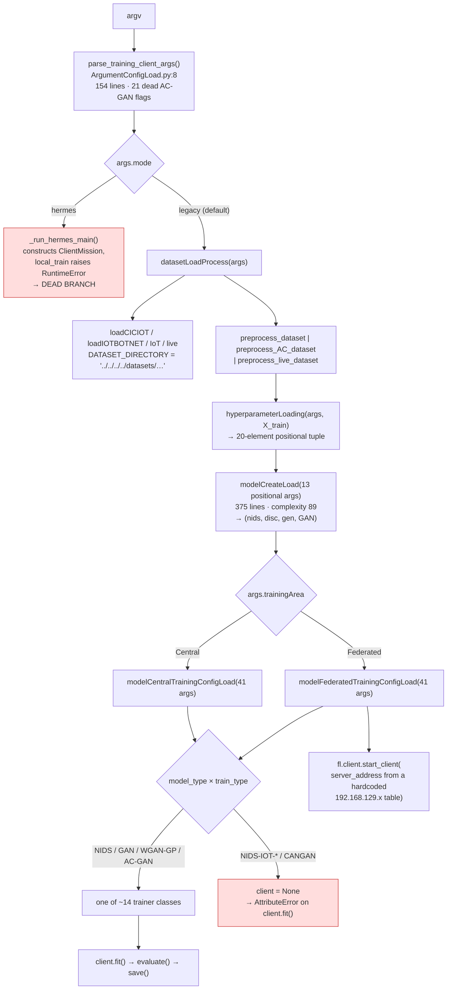

# HIFINS — ML / Training Stack Architecture (As-Built)

**Status:** Review only. No project code has been modified.
**Scope:** `App/`, `Config/`, `Analysis/`, `AppSetup/`, `ModelArchive/`, `experiments/`,
`FlightFramework/` — 46.8 K LOC across 191 modules
**Parent document:** [`../System_Architecture_Overview.md`](../System_Architecture_Overview.md)

---

## 1. What the HIFINS stack is

Everything outside `hermes/`: the AC-GAN / DNN-IDS model definitions, the CIC-IoT-2023
and IoTBotNet data pipeline, ~47 training-loop classes, the Flower-based federated
binaries, the live/adversarial inference apps, the paper-experiment harness, and a
vendored copy of a third-party federated-learning framework.

It is the part of the system that can actually train a model. It is also, by a wide
margin, the least maintainable code in the repository.

Two things dominate its architecture, and both are consequences of a single pattern
choice:

**Configuration-as-code.** Rather than one parameterised trainer driven by a config
object, each (model type × sub-model × training area) combination is a *separate class
in a separate file* carrying its own copy of the training loop, its own loss functions,
its own logger setup, and its own metric plumbing. There are 47 such classes across
21,278 LOC in `Config/ModelTrainingConfig/` alone.

**Positional-tuple plumbing.** State flows between stages as long positional tuples and
41-parameter function calls rather than typed objects. `hyperparameterLoading` returns a
20-element tuple; `modelCentralTrainingConfigLoad` and
`modelFederatedTrainingConfigLoad` each take 41 positional parameters;
`_run_fit_on_end_strategies` takes 42.

---

## 2. Module map

```
App/                                1,938 LOC   entry points
├── TrainingApp/
│   ├── Client/TrainingClient.py      216       centralized + Flower-client binary
│   └── HFLHost/HFLHost.py            193       Flower-server binary
└── InferenceApp/
    ├── Detection/                  1,190       4 near-parallel detection scripts
    └── Generation/                   339       AC-GAN evaluation + distribution

Config/                            26,772 LOC   the bulk of the stack
├── SessionConfig/                  1,659       argparse → dataset → hyperparams → models → trainer
│   ├── ArgumentConfigLoad.py         456         2 parsers (154 + 144 lines) + 2 banner printers
│   ├── datasetLoadProcess.py         120         dataset dispatch
│   ├── hyperparameterLoading.py      190         one 181-line if/elif returning a 20-tuple
│   ├── modelCreateLoad.py            414         one 375-line function, complexity 89
│   └── ModelTrainingConfigLoad/      479         3 dispatchers, 41–42 params each
├── ModelTrainingConfig/           21,278       47 trainer classes / 45 files
│   ├── ClientModelTrainingConfig/
│   │   ├── CentralTrainingConfig/                centralized trainers
│   │   └── HFLClientModelTrainingConfig/         Flower NumPyClient trainers
│   └── HostModelTrainingConfig/                  Flower Strategy subclasses (FitOnEnd)
├── DatasetConfig/                  2,113       CICIoT2023 (v1 + v2), IoTBotNet (v1 + v2),
│                                               IoT, live pcap, preprocessing
└── modelStructures/                1,722       13 NIDS builders, 16 discriminator builders,
                                                generator + GAN assembly

experiments/                       12,053 LOC   paper harness (see §7)
FlightFramework/                    5,853 LOC   vendored "flight" (FLoX) — zero importers
Analysis/                           2,185 LOC   ad-hoc plotting + feature selection
AppSetup/                             187 LOC   testbed bootstrap + Docker + requirements
```

---

## 3. Control flow — the loader chain



Every stage of this chain widens the parameter surface. Adding one hyperparameter
requires editing: the parser, `hyperparameterLoading`'s tuple, both dispatcher
signatures, the trainer's `__init__`, and every call site. That is the mechanical
reason the 21 AC-GAN flags were declared and then never wired.

---

## 4. Model layer

`Config/modelStructures/` holds pure Keras builders — the cleanest part of this stack,
though it carries heavy version sprawl.

**NIDS (`NIDS_Struct.py`, 528 LOC, 13 builders).** The canonical one is
`create_CICIOT_Model(input_dim, regularizationEnabled, DP_enabled, l2_alpha)` — a 5-layer
Dense stack `64→32→16→8→4→1` with BatchNorm, `Dropout(0.4)` and L2-regularized kernels,
~4.7 K parameters / ~18.8 KB at float32. This is what `--mode hermes` and Experiment 4
wire in. The other 12 (`create_high_performance_nids`, `create_balanced_nids`,
`create_lightweight_nids`, `create_optimized_NIDS_model`, `create_optimized_model`,
Conv1D→GRU→LSTM hybrids, IoT variants) are alternatives, several of them experiments
that were never removed.

**Discriminator (`discriminatorStruct.py`, 671 LOC, 16 builders).** The AC-GAN
discriminator alone exists as `build_AC_discriminator_V0`, `_ver_2`,
`build_AC_discriminator`, `build_CAN_AC_discriminator`, `_ver_last`, `_ver_3b`, `_ver_4`,
`_v5`. Eight versions, no deprecation markers, no docstring stating which is current.
Determining the live one requires tracing `modelCreateLoad`'s 375-line branch tree.

**Generator (`generatorStruct.py`, 256 LOC)** and **GAN assembly (`ganStruct.py`, 267 LOC)**
follow the same pattern at smaller scale.

---

## 5. Training layer — the duplication core

47 classes, 45 files, 21,278 LOC. The duplication is not incidental; it is the
structure.

**Exact clone.** `CANGANCentralTrainingConfig.py` (1,900 LOC) is byte-identical to
`ACGANCentralTrainingConfig.py` (1,900 LOC) except for line 53:

```diff
- class CentralACGan:
+ class CANGan:
```

`diff` reports 4 lines of difference across 1,900. The clone is not imported anywhere —
its only reference is a commented-out import at
`modelCentralTrainingConfigLoad.py:43`.

**Near clones.**

| Pair | Total LOC | `diff` lines |
|---|---|---|
| `ACGANCentralTrainingConfig` vs `ACGANClientTrainingConfig` | 3,757 | 444 |
| `ServerACDiscBothFitOnEndConfig` vs `ServerACDiscFitOnEndConfig` | 2,300 | 658 |
| `ciciot2023DatasetLoad.py` vs `ciciot2023DatasetLoadV2.py` | 641 | — v1 is dead, args hardcoded |
| `Config/…/iotbotnet2020DatasetLoad.py` vs `FlightFramework/quickstart/iotbotnetDatasetLoad.py` | 630 | same 267-line `loadIOTBOTNET` |

**Repeated helpers**, counted across the whole stack: `discriminator_loss` ×24,
`generator_loss` ×17, `evaluate_validation_disc` ×17, `evaluate_validation_NIDS` ×14,
`setup_logger` ×12, `probabilistic_fusion` ×10, `log_epoch_metrics` ×10,
`gradient_penalty` ×7. Each copy is an independent place a bug fix must land — which is
exactly what happened during the September-2025 mode-collapse work, whose fixes exist
in some copies and not others.

**Function sizes** inside these classes: `ACGANCentralTrainingConfig.fit` is 499 lines
(complexity 34), `.evaluate` 307 lines, `.validation_disc` 133 lines;
`ServerACDiscBothFitOnEndConfig.aggregate_fit` is 311 lines.

**Hyperparameters are literals inside `__init__`**, e.g.
`ACGANCentralTrainingConfig.py:107-113`:

```python
lr_schedule_gen = tf.keras.optimizers.schedules.ExponentialDecay(
    initial_learning_rate=0.00012, decay_steps=10000, decay_rate=0.98, staircase=False)
lr_schedule_disc = tf.keras.optimizers.schedules.ExponentialDecay(
    initial_learning_rate=0.00007, decay_steps=10000, decay_rate=0.98, staircase=False)
```

while the CLI advertises `--AC_gen_learning_rate` (default 0.00003) and
`--AC_disc_learning_rate` (default 0.00001). Neither flag is read anywhere. Any AC-GAN
hyperparameter sweep run through this CLI produced identical models under different
recorded settings.

---

## 6. Data layer

```
loadCICIOT(train_sample_size, test_sample_size, training_dataset_size,
           testing_dataset_size, attack_eval_samples_ratio, random_seed)
    ↓  DATASET_DIRECTORY = '../../../../datasets/CICIOT2023'
    ↓  os.listdir → sorted → seeded random.sample of N CSV files
    ↓  pd.read_csv per file → per-file benign/attack subsampling → pd.concat
    ↓  returns (train_df, test_df, irrelevant_features)
preprocess_dataset / preprocess_AC_dataset
    ↓  drop irrelevant features → label mapping (1+1 or 7+1) → scaler → train/val split
    ↓  returns 6 arrays
```

Two structural problems:

1. **`'../../../../datasets/CICIOT2023'` is CWD-relative and four levels up.** It
   resolves correctly only when the process working directory is
   `App/TrainingApp/Client/`. The README instructs running
   `python3 App/TrainingApp/Client/TrainingClient.py` **from the repository root**,
   where the path resolves outside the repository's parent. The same literal appears in
   six loaders plus a `/root/datasets/...` variant in the vendored framework.
2. **Whole-dataset materialization.** All selected CSVs are read into pandas, then
   `pd.concat`ed, then converted to numpy — with no chunking, no dtype specification,
   and no `tf.data` pipeline. At the documented default of 400 K training rows this is
   tolerable; the commented-out 800 K configuration in `datasetLoadProcess.py:45-46`
   is not, on an edge node.

Note that the v2 loaders **do** honour their arguments correctly. The v1 loaders
(`ciciot2023DatasetLoad.py`, `iotbotnet2020DatasetLoad.py`) hardcode
`ciciot_train_sample_size = 25` inside the function body and are dead — but they are
still on disk, still importable, and indistinguishable from the live path by name.

---

## 7. Experiment harness

Architecturally separate from the training stack and much better built.

```
experiments/runner/          grid.py · csv_log.py · runner.py           (567 LOC)
    TrialGrid   — cartesian product × arms × trials
                  seed = SHA-256(base_seed | cell_id | trial_index)[:4]
                  → identical across arms ⇒ paired Wilcoxon is valid
    CSVTrialLog — append-only, (cell_id, arm, trial_index) unique key,
                  flush per row, resume by reading the done-set at startup,
                  schema-change detection with an explicit opt-in
    TrialRunner — times each trial, records status ok|error|timeout,
                  one failing trial never aborts the grid

experiments/exp1/   real 1-server + 4-client TCP topology, server is the sole clock
experiments/exp3/   Exp3Sim — pure simulation, A1–A4 scheduler ablation, no subprocesses
experiments/exp4/   real MultiProcessOrchestrator topology + real DNN-IDS training
experiments/analysis/  CSV → figures + LaTeX tables
```

`experiments/runner/` is the second-best-engineered package in the repository. The
analysis layer that consumes it is the opposite: `experiments/analysis/exp3.py` contains
`write_figures`, a **single 863-line function with cyclomatic complexity 170** — the
largest and most complex function in the codebase. `experiments/analysis/exp1.py` has a
215-line / complexity-76 function of the same name. Neither is meaningfully testable;
`test_exp3_analysis.py::test_write_figures_smoke` can only assert that files appear.

---

## 8. Vendored third-party code

`FlightFramework/` is a wholesale copy of **flight / FLoX**, a serverless federated
learning framework by Nathaniel Hudson and Valerie Hayot-Sasson (University of Chicago),
per `FlightFramework/pyproject.toml`. It brings its own `pyproject.toml`, `LICENSE`,
`tox.ini`, `mkdocs.yml`, tests, and a torch dependency — 5,853 LOC across 82 files.

**Nothing in the repository imports it.** `grep -rn "from flight\|import flight"` outside
`FlightFramework/` returns zero hits. The design documents and README describe it as
reused:

> `HERMES_FL_Scheduler_Implementation_Plan.md:30` — "Reuse `strategies` for partial FedAvg
> on mule; reuse `jobs` for round-close report emission; `partial_round_state` checkpoint
> lives here."
> `README.md:157` — "FlightFramework/ # Flight strategies / runtime reused for partial FedAvg"

The plan changed — `hermes/mission/partial_fedavg.py` is 105 lines of standalone numpy —
but the vendored copy and the documentation claiming it is used both remain. It also
carries `quickstart/iotbotnetDatasetLoad.py`, a verbatim duplicate of the project's own
267-line `loadIOTBOTNET` with `/root/datasets/...` paths baked in.

This is a licence-and-provenance surface as much as dead weight: a copied
MIT-licensed third-party project inside a repository that itself has **no `LICENSE`
file**, while the README declares MIT.

---

## 9. Deployment and environment

**`AppSetup/requirements_core.txt`** is described in the README as "Core HERMES + test
deps (always required)" and as sufficient on its own if you "only intend to run the
multi-process HERMES path". In reality it is a `pip freeze` of a developer workstation:
273 pinned packages including `torch`, `torchvision`, `transformers`, `tensorflow`,
`PyQt5`, `ansible`, `boto3`, `azure-storage-blob`, `pymavlink`, `hagrid`, `syft-proto`
and `flwr` — which the same README says core does not need. `requirements_edge.txt`
differs from it by 45 lines out of ~300.

Four of the pins cannot install from PyPI at all:

| Pin | Problem |
|---|---|
| `uuid==1.30` | abandoned 2006 backport; shadows the stdlib `uuid` module |
| `zmq==0.0.0` | placeholder package; the real one is `pyzmq` (also pinned) |
| `serial==0.0.97` | unrelated package; the intended one is `pyserial` (also pinned) |
| `gps==3.19`, `distro-info`, `launchpadlib`, `wadllib`, `ssh-import-id`, `python-apt` | Debian/Ubuntu system packages, not PyPI distributions |

`hermes/` actually needs **numpy and pytest**. Nothing more.

**`AppSetup/DockerSetup/docker-compose.yml`** hardcodes a specific developer's Windows
paths as bind mounts:

```yaml
volumes:
  - C:/Users/kskos/PycharmProjects/FLVision/ciciot2023_archive:/app/CICIOTDataset
  - C:/Users/kskos/PycharmProjects/FLVision/iotbotnet2020_archive:/app/iotbotnet2020_archive
```

— pointing at a *different project directory* than this repository. The compose file
cannot work on any other machine, and it references `flwr-server` / `flwr-client` images
that no Dockerfile in the tree builds under those tags.

**No packaging metadata.** No `pyproject.toml`, no `setup.py`, no `pytest.ini`, no
`conftest.py`, no `LICENSE`. Consequences that show up in the code: 16 modules carry
`sys.path.append(os.path.abspath('../../..'))`; every `python -m hermes.processes.*`
invocation requires CWD = repository root; the `@pytest.mark.slow` markers used by the
README's documented commands are unregistered and emit `PytestUnknownMarkWarning` on
every run.

---

## 10. Test posture

| Area | Coverage |
|---|---|
| `hermes/` | 51 unit + 21 integration modules, ~14.3 K LOC. Strong. |
| `experiments/` | 10 unit modules covering runner, grid, sim envs, metrics. Good. |
| `Config/ModelTrainingConfig/` (21.3 K LOC) | **none** |
| `Config/SessionConfig/` (1.7 K LOC) | none beyond `test_mode_switch.py`'s subprocess smoke |
| `App/` | none |
| `Analysis/` | none |

Local run: **512 passed, 8 failed, 1 skipped**. Of the 8 failures, 7 are environment
(TensorFlow-dependent `exp4_model_task` tests; `flwr`-dependent mode-switch subprocess
tests). One is a genuine stale assertion:
`test_experiments_calibration.py::test_default_calibration_is_placeholder` asserts
`cal.status == "placeholder"` but the shipped TOML was promoted to `"verified"` and the
test was never updated. The README states "410 passed, 22 deselected"; the suite is not
green on `main`.

---

## 11. Known architectural defects in this stack

Full evidence in
[`../../Codebase Review/HIFINS/HIFINS_Findings_and_Refactoring.md`](../../Codebase%20Review/HIFINS/HIFINS_Findings_and_Refactoring.md).

| ID | Defect | Location |
|---|---|---|
| **C-01** | 21 AC-GAN CLI hyperparameters declared and never read | `ArgumentConfigLoad.py:76-96` vs `ACGANCentralTrainingConfig.py:107-113` |
| **C-02** | `--model_type CANGAN` and `NIDS-IOT-*` return `client = None` → `AttributeError` | `modelCentralTrainingConfigLoad.py:70-77,158-166` |
| **C-03** | `--mode hermes` is a non-functional stub on both binaries | `TrainingClient.py:192`, `HFLHost.py:176` |
| **A-04** | Config-as-code: 47 trainer classes, 21.3 K LOC, ×24 duplicated loss functions | `Config/ModelTrainingConfig/` |
| **A-05** | 41–42 positional-parameter dispatchers | `modelCentralTrainingConfigLoad.py:49`, `HFLStrategyTrainingConfigLoad.py:69` |
| **A-06** | No packaging metadata; `sys.path` hacks in 16 modules | repository root |
| **A-07** | 5.8 K LOC vendored `FlightFramework`, zero importers, docs claim reuse | `FlightFramework/` |
| **D-02** | `CANGANCentralTrainingConfig.py` is a 1,900-line byte clone | `Config/…/GAN/FullModel/` |
| **E-01** | `requirements_core.txt` is a workstation `pip freeze` with 4 uninstallable pins | `AppSetup/requirements_core.txt` |
| **E-02** | `docker-compose.yml` hardcodes another project's absolute Windows paths | `AppSetup/DockerSetup/docker-compose.yml` |
| **E-03** | Hardcoded `192.168.129.x` server table in two places | `TrainingClient.py:124-133`, `ArgumentConfigLoad.py:211-220` |
| **M-01** | 863-line / complexity-170 `write_figures` | `experiments/analysis/exp3.py:342` |
| **M-02** | CWD-relative dataset paths contradict the documented invocation | `Config/DatasetConfig/**` |

---

## 12. Where this stack should go

The target is **not** a rewrite. It is:

1. **One parameterised GAN trainer family** replacing 47 near-identical classes,
   driven by frozen dataclass configs. The behaviour of each current class is
   reproducible as a config instance; the loss functions and metric plumbing collapse
   into shared mixins.
2. **Typed config objects** replacing the 20-tuple and the 41-parameter signatures.
3. **A registry-based factory** replacing `modelCreateLoad`'s 375-line branch tree and
   the dispatchers' if/elif chains — which also makes the `client = None` failure modes
   impossible to express.
4. **`hermes_adapters/`** implementing the two `hermes` Protocols (`GeneratorHost`,
   `LocalTrainFn`) against these models, replacing the `--mode hermes` stub with a real
   bridge and leaving `hermes/` untouched.
5. **Packaging + path resolution** so the stack is installable and CWD-independent.

Sequencing, effort, risk and definitions of done are in
[`../../Codebase Review/01_Refactoring_Strategy.md`](../../Codebase%20Review/01_Refactoring_Strategy.md).
Reference implementations are in
[`../../Codebase Review/HIFINS/HIFINS_Production_Code.md`](../../Codebase%20Review/HIFINS/HIFINS_Production_Code.md).
