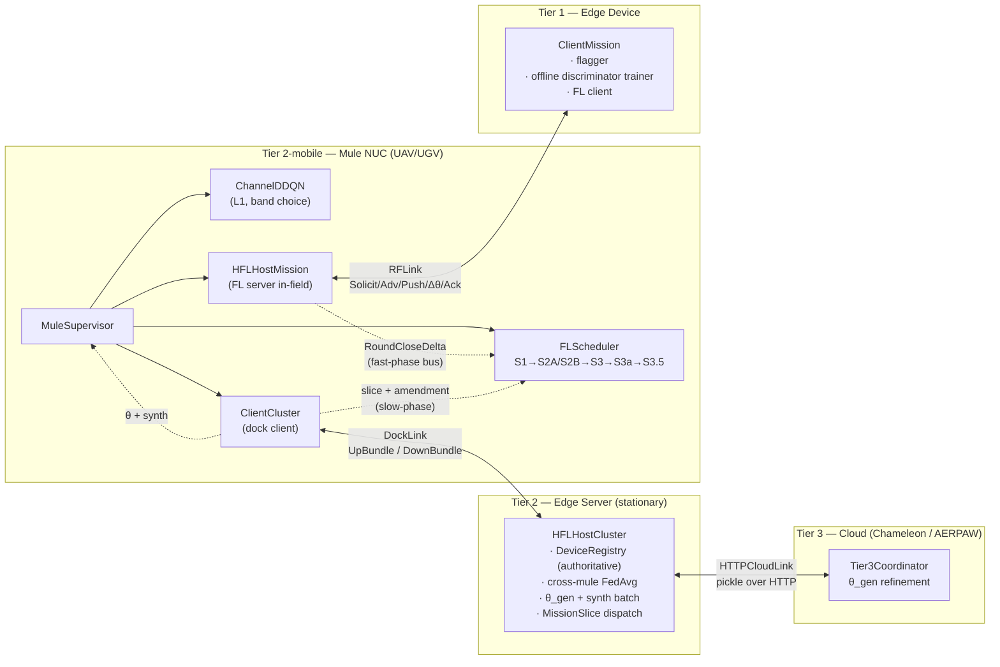

# HERMES — Subsystem Architecture (As-Built)

**Status:** Review only. No project code has been modified.
**Scope:** `hermes/` (69 modules, 14,147 LOC) + its process entry points and tests
**Parent document:** [`../System_Architecture_Overview.md`](../System_Architecture_Overview.md)

---

## 1. What HERMES is

HERMES is the scheduling and transport substrate for mule-assisted hierarchical
federated learning. It replaces the original monolithic Flower server/client pair with
seven cooperating programs distributed across four tiers, and it is deliberately
**framework-free**: no Flower, no TensorFlow, no asyncio, no Docker anywhere in
`hermes/`. Its only third-party runtime dependency is numpy.

That constraint is the single most important architectural decision in the package. It
is why the whole subsystem runs in-process under `Loopback*` transports for testing,
why 512 unit tests execute in 12 seconds, and why the mule NUC does not need a GPU
runtime to schedule.

---

## 2. Package structure and responsibility

| Package | LOC | Responsibility | Depends on |
|---|---|---|---|
| `hermes/types/` | 973 | Value types: bundles, FL messages, scheduler state, IDs, signatures | numpy only |
| `hermes/transport/` | 2,098 | `RFLink` / `DockLink` / `CloudLink` ABCs, TCP implementations, wire framing, channel emulator | `types` |
| `hermes/scheduler/` | 3,290 | `FLScheduler` + S1/S2A/S2B/S3/S3a/S3.5 stages, `TargetSelectorRL`, DDQN, replay, sim env | `types` |
| `hermes/mission/` | 1,552 | `HFLHostMission` (mule-side FL server), `ClientMission` (device), `partial_fedavg`, utility | `types`, `transport` |
| `hermes/cluster/` | 756 | `HFLHostCluster`, `DeviceRegistry`, `cross_mule_fedavg` | `types`, `transport` |
| `hermes/mule/` | 1,335 | `MuleSupervisor`, `ClientCluster`, `BundleDistributor` | all of the above |
| `hermes/l1/` | 363 | `ChannelDDQN` RF band selector, RF prior | `types` |
| `hermes/processes/` | 1,552 | Per-role CLI entry points + `MultiProcessOrchestrator` | all + `experiments` ⚠ |
| `hermes/observability/` | 382 | JSONL event emitter, `MetricsRegistry` | stdlib only |

Dependency direction is clean and acyclic **except** `hermes/processes/{cluster,device}.py`,
which import `experiments.exp4.model_task`. See §9.

---

## 3. The seven programs and where they run



The mule NUC is the only host running a **server role and a client role
simultaneously**: `HFLHostMission` serves devices in-field while `ClientCluster` is a
client to the cluster at dock. The two never run concurrently — `MuleSupervisor`
serializes them into the two-pass mission cycle — but they share the process and the
supervisor's state.

---

## 4. The scheduler pipeline

`FLScheduler` ([`fl_scheduler.py`](../../../hermes/scheduler/fl_scheduler.py)) is an
I/O-free object that composes six pure stage functions. This is the best-factored code
in the repository and should be treated as the model for the rest of it.

```
                        ┌──────────── slow phase (at dock) ────────────┐
                        │  ingest_slice(MissionSlice, ClusterAmendment) │
                        │    → creates/refreshes DeviceSchedulerState   │
                        │    → fold_cluster_amendment (deadline, pos,   │
                        │       delivery_priority)                      │
                        └───────────────────────────────────────────────┘
                                            │
                        ┌──────────── fast phase (in field) ───────────┐
                        │  ingest_round_close_delta(RoundCloseDelta)    │
                        │    → fold_round_close_delta: on-time shrinks  │
                        │      the window −5 s, missed widens it +10 s  │
                        │  ingest_beacon(BeaconObservation)             │
                        └───────────────────────────────────────────────┘
                                            │
  build_contact_queue(rf_range_m)           ▼
   ├─ S1  filter_eligible          has_active_deadline ∨ beacon_heard(window)
   ├─ S3  classify_bucket          NEW | SCHEDULED_THIS_ROUND | BEACON_ACTIVE
   │      compute_deadline         Time + Deadline_Fulfilment − Idle_Time
   │                               (floor MIN_DEADLINE_FULFILMENT_S = 5 s)
   ├─ S3a cluster_by_rf_range      greedy: anchor = max(delivery_priority,
   │                               then earliest deadline); members within
   │                               rf_range_m; stop = centroid if it covers
   │                               everyone, else the anchor's position.
   │                               Contact inherits the worst bucket and the
   │                               tightest deadline of its members.
   └─ S3.5 rank_contacts           DDQN argmax over per-contact features,
                                   ONLY when a bucket has ≥2 candidates;
                                   otherwise distance-sorted fallback.
        → List[ContactWaypoint] in BUCKET_PRIORITY order (NEW first)

  build_pass_2_queue(rf_range_m)
   └─ entire slice (S1 bypassed — every device needs θ'), S3a clustered,
      ordered by order_pass_2_greedy nearest-first from the current pose.
      Selector deliberately bypassed (SelectorScopeViolation if called).
```

**S2A/S2B** do not appear in the queue builder — they are *on-contact* gates, applied
by `HFLHostMission` when an `FLReadyAdv` arrives (`is_on_contact_ready`,
`passes_fl_threshold`), and re-checked there rather than trusted from the scheduler's
cached view. That "never trust remote state blind" discipline is deliberate and
correct.

### Notable invariants the code enforces

| Invariant | Where | Enforcement |
|---|---|---|
| Selector runs in Pass 1 only | `target_selector_rl.py:_enforce_collect_pass` | raises `SelectorScopeViolation` |
| Selector only ranks upstream-admitted candidates | `scope_guard.assert_candidates_admitted` | raises on leak (design principle 12) |
| Pass-2 ordering must not mutate scheduler state | `fl_scheduler.py:469-503` | builds a shadow state map (fix "M3") |
| Untracked `RoundCloseDelta` is a bug, not a miss | `fl_scheduler.py:183` | raises `FLSchedulerError` |
| Aggregation weights are `num_examples` | `partial_fedavg`, `cross_mule_fedavg` | float64 accumulate, cast back |

---

## 5. Mission state machine

`HFLHostMission` holds two overlapping state machines in one object, distinguished by
`_current_pass`:

```
open_round(θ)          →  COLLECT   _current_theta, _accepted=[], _report, _contacts
  run_contact(devs, synth)          broadcast → gather advs → N threads → verify → accept
  …
close_round()          →            partial_fedavg(_accepted) → (aggregate, report, contacts)
                                    clears _current_theta/_report/_contacts, keeps _mission_round

open_pass_2(θ')        →  DELIVER   _current_theta=θ', _delivery_report
  deliver_contact(devs, synth')     broadcast → gather advs → N threads → push → ack
  …
close_pass_2()         →            MissionDeliveryReport
```

Two structural observations:

1. **`run_contact` and `deliver_contact` are 90 % the same function.** 187 and 140
   lines respectively, identical broadcast → misrouted-stash drain → gather → thread
   fan-out → per-device worker skeleton, differing only in the per-device body and the
   outcome enum. Cyclomatic complexity 35 and 32. This is the largest duplicate-logic
   site in `hermes/`.
2. **The "misrouted advertisement stash"** (`_misrouted_advs`) is a workaround for the
   fact that `recv_ready_adv` is a single shared queue with no addressing: a reply from
   a device outside the current contact set has to be caught and re-held for the next
   contact. The comment at `host_mission.py:118-125` documents that the previous
   re-queue approach crashed on TCP because the mule-side server does not implement the
   device→mule direction. The stash works, but it is a symptom of the queue design, not
   a fix for it. See the refactoring plan's `R-H03`.

---

## 6. Transport layer

Two sibling TCP transports with the same shape, one of which is correct.

| | `TCPDockLink` (mule ↔ cluster) | `TCPRFLink` (mule ↔ device) |
|---|---|---|
| Registration frame | `_MuleRegistrationMessage` | `_DeviceRegistrationMessage` |
| Reader socket timeout | `conn.settimeout(None)` — blocks forever | `conn.settimeout(send_timeout_s)` — **30 s** |
| Send timeout | `SO_SNDTIMEO` socket option | none (inherits the read timeout) |
| Idle tolerance | unlimited | **30 s server-side / 60 s client-side** |
| Rationale in comments | "mules can sit idle between missions" | — |

`tcp_dock_link.py:283-299` gets this exactly right and explains why. `tcp_rf_link.py:375`
does the opposite: it sets one timeout for both directions, so a device that says
nothing for 30 seconds trips `socket.timeout` → `OSError` → `WireError` → `break` →
`_drop_device`. On the client side the reader breaks and sets `_closed`, after which
`ClientMission.serve_once` returns `None` immediately on every call and
`DeviceService.run` spins the CPU with no sleep and no reconnect
([`device.py:184-206`](../../../hermes/processes/device.py#L184)).

This never fires in the test suite because every integration test completes in under
30 seconds. It fires on the first real mission with a flight leg longer than half a
minute. Detailed as finding **P-02**.

### Wire format

```
offset  size  field
  0      4    magic  b'HRMS'
  4      1    version (currently 1)
  5      4    length  (big-endian uint32, ≤ 256 MiB)
  9      N    pickle.HIGHEST_PROTOCOL payload
```

Magic catches cross-protocol misconnects, version enables clean rejection of old
senders, and the length cap refuses pathological allocations before `recv`. All three
are correct defensive choices, and `recv_message` saves/restores the socket timeout so
it does not leak across calls (fix "S2-H1"). The pickle codec is justified in a comment
for the co-deployed LAN case; it is **not** justified for `HTTPCloudLink`, which
`pickle.loads` a body fetched from an arbitrary remote URL over plain HTTP with no
authentication and no signature check ([`cloud_link.py:168-171`](../../../hermes/transport/cloud_link.py#L168)).
Note that dock bundles *do* carry a SHA-256 `bundle_sig` (`hermes/types/signatures.py`)
— cloud refinements carry nothing equivalent.

---

## 7. Observability

`JsonEventEmitter` writes one line-buffered JSONL record per event with a versioned
envelope (`ts`, `schema_version`, `role`, `id`, `event`) and re-stamps the reserved keys
so a caller cannot corrupt them. `MetricsRegistry` accumulates counters/gauges/timers
and is dumped as a `metrics_snapshot` event at shutdown. `NullEventEmitter` is a proper
null object, so no call site branches on `emitter is not None`.

The documented contract is *"Observability must never crash the process it is
instrumenting"*. The implementation does not meet it: `json.dumps` is called at
`events.py:108`, **outside** the `try` that guards the write. A non-JSON-serializable
field — a numpy scalar, exactly the case `_coerce`'s docstring says is handled — raises
`TypeError` straight into the instrumented code path. Finding **Q-02**.

Canonical event sequence for one mission (from `test_observability_jsonl.py` and the
README):

```
cluster_ready → mule_ready → device_ready → mule_bootstrapped → dock_bootstrapped
→ mission_started → device_served×N → up_bundle_ingested → cluster_round_closed
→ device_served×N → mission_completed → metrics_snapshot → service_stopped
```

---

## 8. Process lifecycle and orchestration

`MultiProcessOrchestrator` launches `python -m hermes.processes.<role> --config <json>
--run-dir <tmp> [--port-out <file>]` per role in dependency order (cluster → mules →
devices), discovering ephemeral ports through the `--port-out` files.

Things it gets right:
- Background `_StderrDrainer` per child with a 200-line ring buffer, so a chatty child
  cannot deadlock on a full pipe and `OrchestratorError` can quote what the child said.
- `topology.validate()` populates `device_to_mule` once, so later steps read assignment
  from one source of truth instead of mutating `MuleConfig` mid-flight.
- SIGTERM-then-SIGKILL shutdown in reverse startup order, with a documented note that
  Windows `terminate()` is really `TerminateProcess`.

Things it does not:
- `start_devices` ends with a bare `time.sleep(0.3)` "to let TCP connections settle"
  ([`orchestrator.py:336`](../../../hermes/processes/orchestrator.py#L336)) — a race,
  not a barrier. The mule already has `wait_for_devices` built on a `Condition`; the
  orchestrator has no equivalent readiness signal from devices.
- Four `except Exception: pass` blocks in shutdown paths swallow every failure
  including programming errors.

---

## 9. Known architectural defects in this subsystem

Full evidence in [`../../Codebase Review/Hermes/HERMES_Findings_and_Refactoring.md`](../../Codebase%20Review/Hermes/HERMES_Findings_and_Refactoring.md).

| ID | Defect | Location |
|---|---|---|
| **A-02** | `hermes.processes` imports `experiments.exp4.model_task` — inverted layering | `cluster.py:113,140,461`, `device.py:89` |
| **A-03** | `DeviceRegistry.save()` is a no-op; `load()` returns an empty registry | `device_registry.py:210-219` |
| **A-08** | `rebalance` is round-robin over device IDs; ignores position entirely | `device_registry.py:159-165` |
| **A-09** | `ClusterService.run` handles one UP at a time, then dispatches DOWN to all mules inline | `cluster.py:297-375` |
| **P-01** | Unbounded thread-per-device fan-out, per-thread joins | `host_mission.py:519-527, 696-703` |
| **P-02** | RF link 30 s idle read timeout; no keepalive, no reconnect; device hot-spins after drop | `tcp_rf_link.py:375,497`; `device.py:184` |
| **P-03** | `wait_for_dock(timeout=None)` is an uncancellable busy-poll | `client_cluster.py:215-226`, called at `mule_main.py:306,425` |
| **Q-01** | `Sequence` used in annotations but never imported | `host_mission.py:344,568` |
| **Q-02** | `json.dumps` outside the guarded region defeats "never crash the caller" | `events.py:108` |
| **Q-03** | `self.cluster._cluster_round` — private access despite a public property | `cluster.py:346,350` |
| **D-01** | `run_contact` / `deliver_contact` ~90 % duplicated | `host_mission.py:342-528, 566-705` |
| **S-01** | `pickle.loads` of a remote HTTP body, unauthenticated, unsigned | `cloud_link.py:171,242` |

---

## 10. Extension points that are already the right shape

Any future work should go **through** these rather than around them:

```python
# hermes/cluster/host_cluster.py:49
class GeneratorHost(Protocol):
    def make_synth_batch(self, n: int) -> List[np.ndarray]: ...
    def get_global_disc_weights(self) -> Weights: ...
    def update_disc_from_cluster_avg(self, weights: Weights) -> None: ...
    def apply_tier3_gen_refinement(self, weights, refinement_round=0) -> None: ...

# hermes/mission/client_mission.py:71
class LocalTrainFn(Protocol):
    def __call__(self, theta_disc: Weights,
                 synth_batch: List[np.ndarray]) -> LocalTrainResult: ...
```

Today the only production implementations are `StubGeneratorHost` (emits zero tensors
as "synthetic samples") and a Gaussian-noise `_stub_train_factory`. Implementing these
two Protocols against the real Keras AC-GAN and DNN-IDS models — in a new
`hermes_adapters/` package that depends on both sides — joins the two stacks **without
touching a single line of `hermes/`**. That is the highest-leverage change available in
this repository and it is already designed for; it just was never built.
