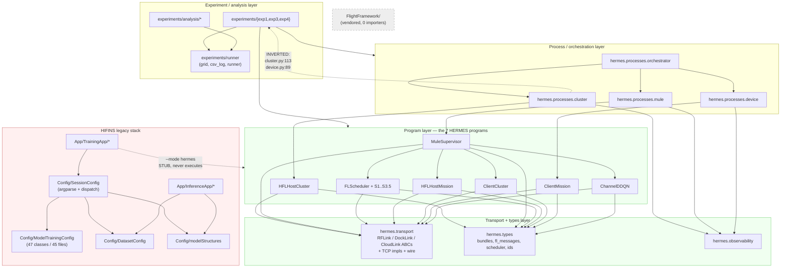
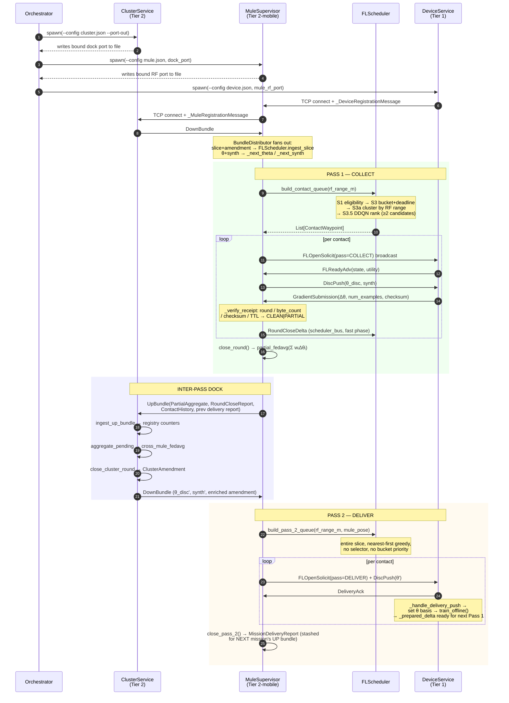
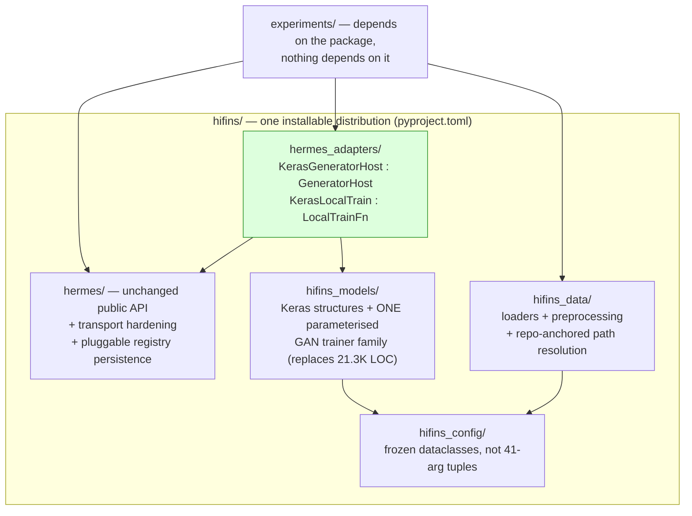

# HiFINS — System Architecture Review (As-Built)

**Status:** Review only. No project code has been modified.
**Date:** 2026-08-10
**Scope:** Whole repository at `main` @ `35e2eeb`
**Author:** Architecture review pass (reverse-engineered from source, not from design docs)
**Grounded in:** *HERMES: A Layered Coordination Framework for Federated Learning with
Drones as Data Mules* (ACM/IEEE SEC 2026 submission) · the DeveloperDocs design set ·
the code as read
**Companions:** [Problem statement §2](#2-problem-statement) ·
[Solution statement §3](#3-solution-statement) ·
[Traceability §4](#4-problem--solution-traceability) ·
[CEDA comparison](../Comparative%20Analysis/CEDA_vs_HERMES.md) ·
[findings register](../Codebase%20Review/00_Critical_Problem_Areas.md)

---

## 0. How this review was produced

This document describes the system **as the code actually is**, not as the design
documents say it should be. Where the two disagree, the disagreement is called out
explicitly — those gaps are findings in their own right.

Method:

1. Read every entry point, every transport, every scheduler stage, and the full
   mission/cluster/device lifecycle in `hermes/`.
2. Read the legacy training and inference binaries in `App/`, the loader chain in
   `Config/SessionConfig/`, and a representative sample of `Config/ModelTrainingConfig/`.
3. Read the experiment harness (`experiments/runner`, `exp1`, `exp3`, `exp4`).
4. Ran a static AST audit across all 357 first-party Python files measuring function
   length, cyclomatic complexity, parameter counts, exception-handling shape,
   thread/sleep call sites, and cross-object private access.
5. Ran an unresolved-name pass (names referenced but never bound in a module).
6. Ran the unit suite locally: **512 passed, 8 failed, 1 skipped**.
7. Diffed suspected duplicate modules byte-for-byte.

Companion documents:

- [`Hermes/HERMES_Architecture.md`](Hermes/HERMES_Architecture.md) — deep dive on the distributed subsystem
- [`HIFins/HIFINS_Architecture.md`](HIFins/HIFINS_Architecture.md) — deep dive on the ML/training stack
- [`../Codebase Review/00_Critical_Problem_Areas.md`](../Codebase%20Review/00_Critical_Problem_Areas.md) — severity-ranked findings
- [`../Codebase Review/01_Refactoring_Strategy.md`](../Codebase%20Review/01_Refactoring_Strategy.md) — phased plan

---

## 1. Executive summary

HiFINS is **two independent systems in one repository**, joined by a bridge that does
not carry traffic.

| | **HIFINS stack** (2024–2025) | **HERMES stack** (2025–2026) |
|---|---|---|
| Purpose | Centralized / Flower-federated AC-GAN + DNN-IDS training and inference | Mule-assisted hierarchical FL scheduling, transport, and orchestration |
| Entry points | `App/TrainingApp/*`, `App/InferenceApp/*` | `python -m hermes.processes.{cluster,mule,device}` |
| Style | Procedural, TensorFlow-coupled, config-as-code | Layered, framework-free, protocol-driven, dependency-injected |
| Size | ~30.9 K LOC (`App` + `Config` + `Analysis`) | ~14.1 K LOC (`hermes/`) |
| Test coverage | Effectively none | ~14.3 K LOC of tests, 512 passing |
| Quality | Low — heavy duplication, dead knobs, 40+ parameter functions | High — the strongest code in the repository |

The declared bridge between them is `--mode hermes` on both legacy binaries. **It is a
stub.** On the client it raises `RuntimeError` the moment training is attempted
([`TrainingClient.py:192-197`](../../App/TrainingApp/Client/TrainingClient.py#L192)); on
the host it constructs a cluster object, prints a banner, and returns without serving
([`HFLHost.py:176-189`](../../App/TrainingApp/HFLHost/HFLHost.py#L176)). The README
presents this as "the HERMES path". It is not.

The **real** integration point is much narrower and points the wrong way:
`hermes/processes/cluster.py` and `hermes/processes/device.py` import
`experiments.exp4.model_task` to load real weights and run real training
([`cluster.py:113`](../../hermes/processes/cluster.py#L113),
[`device.py:89`](../../hermes/processes/device.py#L89)). The core library depends on the
experiment harness — an inverted layer dependency, acknowledged in a code comment but
not resolved.

**Bottom line:** the HERMES subsystem is production-shaped and well-tested. The HIFINS
stack it was supposed to replace is still the only thing that can actually train a
model, and it is the least maintainable code in the repository. The seam between them
is fictional. Everything else in this review follows from that.

---

## 2. Problem statement

The system exists to make federated learning work **where the network does not**. This
section itemizes the problem so that every mechanism in §3 can be traced back to a
specific pressure it relieves; §4 is that trace.

Sources: the SEC 2026 paper (*HERMES: A Layered Coordination Framework for Federated
Learning with Drones as Data Mules*), the design documents, and the code as read at
`main` @ `35e2eeb`. Where the paper and the code disagree, §4.3 records the divergence.

### 2.1 What cannot be assumed

The deployment premise is a **DDIL** environment — disconnected, disrupted, intermittent,
low-bandwidth — of the kind found in disaster response, tactical edge, and remote
infrastructure monitoring. Four assumptions that conventional FL depends on are all
withdrawn at once:

| Conventional FL assumes | DDIL reality |
|---|---|
| A path exists from every client to the aggregator | The federation graph is *fragmented*; some devices have no backhaul at all |
| Rounds are synchronized and bounded | Round time is governed by physical vehicle travel, not by network RTT |
| Clients are reachable when the server calls them | Contact is opportunistic, brief, and discovered on arrival |
| Bandwidth is stable enough to size a round | Effective SNR varies with mobility, terrain blockage, and interference |

The consequence is that the aggregator cannot *pull*. Something must physically carry
model state across the disconnection — which is the premise the rest of the design
follows from.

### 2.2 Communication-layer problems

**P-1 — There is no end-to-end path.** FedAvg relies on synchronized rounds and is
vulnerable to timeouts and stalled convergence when clients drop out. Hierarchical and
semi-decentralized FL relax this only partially: they still assume the federation graph
stays connected and that intermediate aggregators are reachable. Under persistent
fragmentation no link-relaying scheme closes the round at all.

**P-2 — Moving raw data over the shaped link is infeasible.** Centralized training
requires transporting datasets. Under a bandwidth cap with jitter and loss, bulk transfer
is exposed to repeated retransmission and congestion-window collapse, while a
model-update exchange is not. The paper measures this directly: under the jittery link,
centralized wall-time inflates **9.9×** against FL's **3.1×** (Observation 1) — the same
impairment produces fundamentally different system behaviour depending on what is being
moved.

**P-3 — A fixed radio channel is either wasteful or trapped.** UAV mobility, terrain
blockage and channel fluctuation cause large variation in effective SNR. A static
assignment made at deployment time cannot know the SNR landscape ahead of time, so it
either underutilizes available capacity or remains stuck in a poor link for the mission.
The cost of guessing wrong is severe and asymmetric: the worst fixed channel delivers
**−60.2 %** against the expected-fixed baseline, and no deployer can know in advance which
channel that is (Table II).

### 2.3 Scheduling-layer problems

**P-4 — Mission budget is finite and contested.** Flight time, propulsion energy, and
contact opportunities are bounded. Visiting every device every round is not an option, so
*who to visit* is a resource-allocation decision, not a traversal-optimization one. The
metric that matters is energy **per completed update** (J/Δθ), not energy per mission —
a mission that finishes early by collecting nothing is not efficient.

**P-5 — Device readiness is unobservable before contact.** A device may be busy,
powered down, out of range, or simply have nothing worth federating. The scheduler must
commit to a destination using stale state and then re-verify on arrival, because remote
state is never trustworthy at planning time.

**P-6 — Deadline pressure is heterogeneous and non-stationary.** Devices differ in
participation history and in how long they have been idle, and both change *within* a
mission as contacts succeed or fail. A single global deadline misallocates in both
directions: too slack and the mission wastes budget, too tight and reachable devices are
abandoned.

**P-7 — Greedy deadline-first scheduling burns budget on infeasible work.** Earliest-
deadline-first is optimal for feasible deadline-constrained scheduling, but it commits to
an early-deadline job even when the current mission state makes completion unlikely.
Under a constrained budget this is actively harmful: the paper's overloaded scenario has
EDF completing 2.00 jobs and failing 3.00, against HERMES completing 3.00 and failing
2.00 — a 50 % improvement obtained *by abandoning lost causes early*, not by attempting
more transmissions (Observation 2).

**P-8 — Sequential servicing wastes the radio's reach.** If the scheduler treats each
device as an isolated destination, it makes one stop per device even when several sit
inside a single RF radius. The opportunity is real and grows with range: at small `r_rf`
most contacts contain one device, but as `r_rf` increases multiple devices become
serviceable per stop.

### 2.4 Learning-layer problems

**P-9 — Asynchronous aggregation drifts.** If the updates collected in one round were
trained against *different* global models, the average is not a well-defined federated
step. A mule that collects opportunistically will, by default, gather exactly such a
mixture.

**P-10 — Stalling on absent participants defeats the purpose.** Waiting for a delayed
mule reintroduces the synchronization dependency the architecture exists to remove. But
simply dropping absentees loses their contribution permanently.

**P-11 — Priority ordering starves the tail.** Any strictly ordered scheduler will
systematically under-serve the devices at the bottom of the order. Under a constrained
budget this is not hypothetical: the question is whether service is *distributed* across
the device population or concentrated on a feasible subset, and that must be measured
rather than assumed.

### 2.5 The cross-layer problem

**P-12 — The three layers are coupled and cannot be solved in isolation.** Each imposes
binding constraints on the others:

- The shortest path to a high-value device may cross a low-signal zone, so a routing
  decision made without radio state silently loses the update it flew for.
- Conserving propulsion energy by skipping distant devices changes which updates are
  available to aggregate, so an energy decision is also a learning decision.
- Serving the highest-priority devices first depletes the budget before the remainder are
  reached, so a priority decision is also a coverage decision.

This is the thesis the architecture is organized around, and it is shared with the
lab's CEDA work on multi-drone medical delivery — see
[`../Comparative Analysis/CEDA_vs_HERMES.md`](../Comparative%20Analysis/CEDA_vs_HERMES.md),
which reaches the same conclusion from a different domain and makes the *opposite* choice
about how to act on it.

---

## 3. Solution statement

HERMES — **H**ierarchical **E**dge **R**F-adaptive **M**obility-aware **E**nabled
**S**ynthesis — answers §2 with three layers and four design commitments. This section
states each mechanism concretely enough to be checked against the code.

### 3.1 Design commitments

These constrain every mechanism below, and they are the reason the architecture looks the
way it does.

**C-1 — Move models, not data.** The only thing that crosses a link is a model update or
a global model, never a dataset. This is what makes the bandwidth budget survivable.

**C-2 — Carry state physically; never assume a path.** The mule *is* the transport. A
disconnection is a scheduling input, not a failure.

**C-3 — Learn narrowly; decide deterministically.** Deterministic gates decide who is
eligible; a learned policy only breaks ties among candidates the gates already admitted.
This bounds inference cost, keeps decisions explainable, and is enforced structurally
rather than by convention.

**C-4 — Decouple the layers behind interfaces.** Each layer publishes a small, typed
signal to the next rather than sharing state. Mobility, radio, and FL scheduling are
independently replaceable.

### 3.2 Layer 1 — RF-adaptive communication

**S-1 — Cost-aware adaptive channel selection.** A utility-driven controller scores each
candidate channel and switches only when the expected benefit exceeds the cost of
switching:

```
U(c, t) = R(γ₁(t) + g(c)) − κ(c) − λ(c, t)
```

where `R(·)` maps to a rate tier, `γ₁(t)` is the baseline SNR observation, `g(c)` the
channel-dependent effective-SNR gain, `κ(c)` a channel-use cost, and `λ(c, t)` a switching
cost. The channel-use term discourages unconditional selection of the highest-gain
channel; the switching term prevents oscillation under short-term SNR fluctuation.
Implementation: [`hermes/l1/channel_utility.py`](../../hermes/l1/channel_utility.py),
[`hermes/l1/rf_prior.py`](../../hermes/l1/rf_prior.py).

**S-2 — RF priors published upward, not consumed laterally.** Layer 1's role in the
architecture is to *expose* link quality to the scheduler, not to own routing. The
selector receives `rf_prior_snr_db` as one feature among eleven. This is what lets the
radio policy be replaced — heuristic today, learned later — without touching Layer 2.

### 3.3 Layer 2 — Mobility-aware federated scheduling

**S-3 — Four-stage deterministic gate.** Candidates pass through
S1 eligibility → S2A on-contact readiness → S2B FL-readiness flag → S3 deadline and
bucket ranking. Each stage is a pure function over explicit state
([`hermes/scheduler/stages/`](../../hermes/scheduler/stages/)), and `FLScheduler` itself
is I/O-free with an injected clock
([`fl_scheduler.py`](../../hermes/scheduler/fl_scheduler.py)).

**S-4 — Per-device adaptive deadline.**

```
Deadline(j) = t_base + Φ(j) − ι(j)
```

`Φ(j)` is the device's historical participation reliability, `ι(j)` its idle duration.
A device that participates reliably earns slack; one that has been idle a long time is
pulled forward. Floored at `MIN_DEADLINE_FULFILMENT_S` so the formula cannot drive the
window to zero ([`s3_deadline.py`](../../hermes/scheduler/stages/s3_deadline.py)).

**S-5 — Two-phase deadline adaptation.** The *fast* phase folds a `RoundCloseDelta` in
flight the moment a contact resolves — a clean outcome shrinks the window by 5 s, a miss
widens it by 10 s. The *slow* phase folds cluster amendments at dock. The system stays
globally consistent while responding to in-mission reality.

**S-6 — RF-range contact clustering (S3a).** Devices within `r_rf` of an anchor are
grouped into one `ContactWaypoint`, served by a single stop with one broadcast
solicitation and parallel per-device exchange. The stop position is the cluster centroid
when it covers every member, else the anchor's own position — geometrically guaranteed
coverage, no hidden cleverness
([`s3a_cluster.py`](../../hermes/scheduler/stages/s3a_cluster.py)). The efficiency of this
is measured directly as `ρ_contact`, devices served per contact event.

**S-7 — Bounded RL tie-break (S3.5).** Within the highest-priority non-empty bucket, and
**only when that bucket holds two or more candidates**, a DDQN ranks the contacts. Its
reward is

```
r_contact = Σ_{i ∈ contact} b_completed(i) − τ_contact − w_e · ε_contact
```

— aggregation reward, minus contact duration, minus weighted energy. The action space is
restricted to one bucket, which is what keeps inference overhead bounded rather than
combinatorial ([`target_selector_rl.py`](../../hermes/scheduler/selector/target_selector_rl.py),
gate at [`fl_scheduler.py:412-416`](../../hermes/scheduler/fl_scheduler.py#L412)).

**S-8 — Scope guard.** If a candidate the gates did not admit ever reaches the selector,
`assert_candidates_admitted` raises `SelectorScopeViolation`
([`scope_guard.py`](../../hermes/scheduler/selector/scope_guard.py)). Commitment C-3 is
enforced by the type system and a runtime check, not by discipline. The selector is
likewise barred from Pass 2 entirely.

**S-9 — Feasibility-aware selection.** The selector's features include remaining mission
budget and estimated transit cost, so it can decline a contact it cannot complete and
preserve budget for achievable ones — the mechanism behind Observation 2.

### 3.4 Layer 3 — Hierarchical federated intelligence

**S-10 — Offline local training, exchange-only contact.** Devices train between visits
against the last delivered global model and stage a prepared `Δθ`. A contact is reduced
to push-receive synchronization, so contact time is spent on transfer, not computation
([`client_mission.py`](../../hermes/mission/client_mission.py), `train_offline`).

**S-11 — Two-pass mission: COLLECT then DELIVER.** Pass 1 collects `Δθ` from in-range
devices; the mule docks and the cluster aggregates; Pass 2 redistributes the refreshed
global model to every slice member. Every update collected in Pass 1 was trained against
the model delivered by the *previous* mission's Pass 2, so cross-mule averaging is exact
by construction. This is the structural answer to drift, and it costs a deliberate
increase in propulsion overhead
([`mule_main.py:325`](../../hermes/mule/mule_main.py#L325)).

**S-12 — Two-scope aggregation.** Mission-scope partial FedAvg merges in-range updates
during flight ([`partial_fedavg.py`](../../hermes/mission/partial_fedavg.py)); cluster-scope
cross-mule FedAvg merges mission aggregates at dock
([`cross_mule_fedavg.py`](../../hermes/cluster/cross_mule_fedavg.py)). Both are pure
functions that validate shapes and rounds up front and accumulate in float64. Cross-mule
aggregation happens once per docking cycle, which is what bounds synchronization overhead.

**S-13 — Never stall; reconcile later.** `min_participation` defaults to 1, so the
cluster closes a round as soon as any mule reports rather than waiting for the slowest.
Unfinished contributions are reconciled in a future round through the `ClusterAmendment`
mechanism instead of being dropped.

**S-14 — Authoritative registry with disjoint slicing.** The edge server owns the
`DeviceRegistry` and issues each mule a disjoint `MissionSlice` per dock, so two mules
cannot both claim a device in one round
([`device_registry.py`](../../hermes/cluster/device_registry.py)).

### 3.5 Cross-layer interfaces

Three typed signals, and nothing else, cross a layer boundary:

| Signal | Direction | Carries |
|---|---|---|
| Target waypoint | L2 → L1 | where the mule is going, so the radio can pre-adapt |
| `RoundCloseDelta` | L3 → L2 | per-contact outcome, driving fast-phase deadline adaptation |
| Dock bundle (`UpBundle` / `DownBundle`) | mule → edge server | mission aggregate up, refreshed global model + slice + amendments down |

### 3.6 Measurement as part of the solution

Fairness and coverage are not enforced by a constraint — they are **measured**, and the
measurement is part of the design:

- **Jain's fairness index** `J = (Σx)² / (N · Σx²)` over per-device service counts.
- **Participation entropy** — Shannon entropy of the service-share distribution.
- **`completion_fairness`** — Jain over per-device *completion* counts. This is the
  contestable one: visit-based Jain is trivially 1.0 for the centralized arm's universal
  sampling, whereas completion-based fairness exposes contribution inequality.
- **`ρ_contact`**, **Pass-2 delivery coverage**, **update yield**, **round close rate** at
  four quorum thresholds.

All in [`experiments/exp3/metrics.py`](../../experiments/exp3/metrics.py).

### 3.7 What the solution deliberately does not do

Stated so the omissions read as decisions rather than gaps:

- **No inter-mule coordination in flight.** Disjoint slicing removes the need for it.
- **No multi-hop relay.** The mule is the only transport; relay chains are future work.
- **No learned routing.** Navigation between known positions is mechanical; the RL budget
  is spent on selection, not trajectory.
- **No fairness *enforcement*.** Only measurement — see the gap noted in §4.2.

---

## 4. Problem → solution traceability

### 4.1 Mapping

Each row is one solution-method detail, the problem item it addresses, the mechanism that
does the work, where it lives, and the evidence that it works.

| Solution detail | Addresses | Mechanism | Implemented in | Evidence |
|---|---|---|---|---|
| **S-1** Cost-aware channel utility `U(c,t)` | P-3 | Switch only when expected gain exceeds use + switching cost | `l1/channel_utility.py` | Table II: **+17.3 %** offload vs expected-fixed, 6 switches |
| **S-2** RF priors published to L2 | P-3, P-12 | `rf_prior_snr_db` as a selector feature, not a routing input | `selector/features.py` | Layer-1 policy replaceable without touching L2 |
| **S-3** Four-stage deterministic gate | P-5, P-6, P-12 | Pure-function stages over explicit state; re-verify on arrival | `scheduler/stages/` | S2A/S2B re-checked at contact, never trusted from cache |
| **S-4** Adaptive deadline `t_base + Φ(j) − ι(j)` | P-6 | Reliability earns slack; idleness pulls forward | `stages/s3_deadline.py` | Fig. 9: update yield rises with β across all mule arms |
| **S-5** Two-phase deadline adaptation | P-6, P-5 | Fast fold in flight (−5 s / +10 s), slow fold at dock | `stages/s3_deadline.py`, `fl_scheduler.py` | Keeps global consistency under in-mission change |
| **S-6** S3a RF-range contact clustering | P-4, P-8 | One stop serves every device within `r_rf`; centroid-or-anchor | `stages/s3a_cluster.py` | `ρ_contact` rises with `r_rf`; sequential baselines stay ≈1 |
| **S-7** Bounded DDQN tie-break | P-4, P-7, P-12 | Rank inside top bucket only; reward trades yield vs time vs energy | `selector/target_selector_rl.py` | **A4 lowest propulsion energy**: 2754 J/Δθ clean, 2641 jittery (Table VII) |
| **S-8** Scope guard + Pass-2 bar | P-7 | `SelectorScopeViolation` on any un-admitted candidate | `selector/scope_guard.py` | Commitment C-3 enforced at runtime, not by convention |
| **S-9** Feasibility-aware selection | P-7, P-4 | Budget and transit cost in the state; decline the unachievable | `selector/features.py` | Obs. 2: **3.00 done / 2.00 failed** vs EDF 2.00 / 3.00 |
| **S-10** Offline training, exchange-only contact | P-4, P-5 | `train_offline()` stages `Δθ` between visits | `mission/client_mission.py` | Contact cost is transfer-bound, not compute-bound |
| **S-11** Two-pass COLLECT → DELIVER | **P-9** | Every collected `Δθ` trained against the previously delivered θ | `mule/mule_main.py:325` | Drift structurally impossible, not merely bounded |
| **S-12** Mission + cluster scope FedAvg | P-1, P-2 | Partial merge in flight; cross-mule merge once per dock | `partial_fedavg.py`, `cross_mule_fedavg.py` | Aggregation overhead bounded per docking cycle |
| **S-13** `min_participation = 1`, amendments | **P-10** | Close on first report; reconcile absentees in a later round | `cluster/host_cluster.py` | No stall on a delayed mule; contribution not lost |
| **S-14** Registry + disjoint slicing | P-5, P-12 | One mule owns a device per round; slice reissued each dock | `cluster/device_registry.py` | Cross-mule double-claim impossible by construction |
| **C-1** Model updates, never datasets | **P-2** | Only `Δθ` / θ cross a link | whole L3 | Obs. 1: FL **3.1×** vs centralized **9.9×** jittery inflation |
| **C-2** Physical transport by mule | **P-1** | Mule carries state across the disconnection | whole architecture | Obs. 3: A1 participation collapses **0.37 → 0.03** under jitter; mule arms degrade gracefully |
| **S-6+S-7** Contact-aware + learned selection | P-4 | Spatial clustering plus feasibility ranking | L2 | Obs. 4: benefit comes from *allocating* mission time, not only from mobility |
| **§3.6** Fairness + coverage metrics | P-11 | Jain, participation entropy, completion fairness | `experiments/exp3/metrics.py` | Makes starvation observable across 8,640 paired trials |

### 4.2 Reverse coverage — is every problem answered?

| Problem | Answered by | Status |
|---|---|---|
| P-1 no end-to-end path | C-2, S-12 | **Solved** — the premise of the architecture |
| P-2 raw data infeasible | C-1 | **Solved** — measured, Obs. 1 |
| P-3 fixed channel | S-1, S-2 | **Partial** — the deployed controller is the deterministic heuristic; the learned channel policy is future work in the paper, and `hermes/l1/channel_ddqn.py` exists in code but is not the evaluated policy |
| P-4 finite budget | S-6, S-7, S-9, S-10 | **Solved** — measured as J/Δθ, Obs. 4 |
| P-5 unobservable readiness | S-3, S-10, S-14 | **Solved** — re-verify on arrival |
| P-6 heterogeneous deadlines | S-4, S-5 | **Solved** |
| P-7 infeasible-work waste | S-9, S-7, S-8 | **Solved** — measured, Obs. 2 |
| P-8 sequential servicing | S-6 | **Solved** — measured as `ρ_contact` |
| P-9 async drift | S-11 | **Solved structurally** — the strongest claim in the design |
| P-10 stalling | S-13 | **Solved** |
| **P-11 starvation** | §3.6 metrics only | **⚠ Measured, not enforced.** No mechanism prevents a persistently low-priority device from never being visited. Bucket priority is strictly ordered with no weight-agnostic floor. See [`../Comparative Analysis/CEDA_vs_HERMES.md`](../Comparative%20Analysis/CEDA_vs_HERMES.md) §6 — CEDA's cheapest and most effective fairness device is a **weight-agnostic** miss penalty, which HERMES has no analogue for |
| P-12 cross-layer coupling | S-2, S-3, S-7, §3.5 | **Partial** — the interfaces exist and are typed, but no experiment has isolated which layer's *information* actually carries the result. See §4.3 |

Two open items, both actionable: the fairness floor (P-11) and a cross-layer information
ablation (P-12).

### 4.3 Paper ↔ implementation correspondence

Reading the paper against the code surfaces three divergences. None invalidates a
published number; all three matter for the next revision.

**D-1 — Layer 1's policy class.** The paper's §III-A states the learned DDQN/CTDE
controller "is left as future work" and that the evaluated policy is the deterministic
utility heuristic; Figure 2's Layer-1 box nonetheless annotates the RF Channel Selector
with "Training: CTDE on AERPAW digital twin". The repository contains
[`hermes/l1/channel_ddqn.py`](../../hermes/l1/channel_ddqn.py) — a real DDQN — but it is
not the policy behind Table II. **The figure and the text disagree; the text is correct.**
Worth reconciling before submission, because a reviewer comparing the two will read the
figure as an overclaim.

**D-2 — The GAN half is inert in the HERMES path.** The paper's Layer 3 shows an
Intrusion Detection Model fed by hierarchical aggregation. In the code, the cluster's
generator is `StubGeneratorHost`, whose `make_synth_batch` returns **zero tensors**, and
the device-side training callback in `experiments/exp4/model_task.py:150-152` accepts and
explicitly discards the synth batch. Real DNN-IDS weights *are* aggregated on the EX-4.1
path, so the FL results stand — but the *GAN* contribution to "GAN-based NIDS" has never
executed inside HERMES. See finding
[A-01](../Codebase%20Review/00_Critical_Problem_Areas.md#a-01).

**D-3 — Two evaluation substrates, one name.** The scheduling results (Tables VI–VII,
Figs. 7–10) come from the abstracted mobile-relay simulation in
[`experiments/exp3/sim_env.py`](../../experiments/exp3/sim_env.py), not from the
multi-process TCP topology in [`hermes/processes/`](../../hermes/processes/). Both are
legitimate and the paper says so, but the architecture documents should be read with the
distinction in mind: §7 describes the process topology; the paper's scheduling numbers
describe the simulator.

### 4.4 Where this sits relative to CEDA

The lab's CEDA work reaches the same cross-layer conclusion (P-12) in a different domain
and answers it the opposite way — one monolithic CTDE DQN that internalizes all three
layers, against HERMES's deterministic gates plus a narrow tie-break. The full comparison,
including CEDA's cross-layer *information* ablation and what it implies for P-12 here, is
in [`../Comparative Analysis/CEDA_vs_HERMES.md`](../Comparative%20Analysis/CEDA_vs_HERMES.md).

---

## 5. Repository map

```
HiFINS/                              LOC     Files   Role
├── hermes/                        14,147      69    HERMES distributed system  ← core
├── Config/                        26,772      65    Model/dataset/training configuration
│   ├── ModelTrainingConfig/       21,278      45      Per-model training loops (config-as-code)
│   ├── DatasetConfig/              2,113       9      CICIoT2023 / IoTBotNet loaders + preprocessing
│   ├── modelStructures/            1,722       4      Keras model definitions (NIDS, GAN, AC-GAN, WGAN)
│   └── SessionConfig/              1,659       7      argparse + loader dispatch chain
├── tests/                         14,310      73    Unit (51) + integration (21)
├── experiments/                   12,053      40    Paper-experiment harness (Exp 1/3/4)
├── FlightFramework/                5,853      82    Vendored third-party "flight" (FLoX) — UNUSED
├── hermes_rl/                      2,251       4    Untracked nested git repo — drone RL prototype
├── Analysis/                       2,185      12    Ad-hoc plotting / feature-selection scripts
├── App/                            1,938       7    Legacy Flower binaries + inference apps
├── AppSetup/                         187       2    Testbed bootstrap + Docker + requirements
├── DeveloperDocs/                    338       3    Design docs + loose analysis scripts
├── ModelArchive/                       —      —     Trained .h5 checkpoints
└── results/                            —      —     Experiment trial CSVs
```

**Absent from the root and material to the architecture:** `pyproject.toml`,
`setup.py`, `pytest.ini`, `LICENSE`, `conftest.py`. The README's repository-layout
section lists `pytest.ini`; it does not exist. The README declares an MIT license and
links `LICENSE`; the file does not exist. There is no installable package metadata of
any kind, which is why 16 modules carry `sys.path.append(os.path.abspath('../../..'))`.

---

## 6. Layer model and dependency direction



**Dependency rules the code actually obeys:**

- ✅ `hermes.types` depends on nothing but stdlib + numpy. Clean leaf.
- ✅ `hermes.transport` depends only on `hermes.types`. Clean.
- ✅ Program layer depends on transport **ABCs**, never concrete TCP classes. This is
  the single best decision in the codebase — it is why `hermes/` is testable.
- ✅ `hermes.observability` is a leaf with a null-object default, so the program layer
  never branches on `emitter is not None`.
- ❌ `hermes.processes.{cluster,device}` import `experiments.exp4.model_task`. Layer
  inversion: the reusable library depends on the throwaway harness.
- ❌ `App/TrainingApp` "depends" on `hermes` through a dead branch.
- ❌ `FlightFramework/` has zero importers anywhere in the repository, yet the design
  documents and README describe it as reused for partial FedAvg.

---

## 7. Complete data flow

### 7.1 HERMES mission flow (the real path)

This is the flow exercised by `tests/integration/test_e2e_topology.py` and by
Experiment 4. Each numbered step names the concrete call site.



**Why two passes.** Every Δθ collected in Pass 1 was trained against the θ delivered by
the previous mission's Pass 2. That makes cross-mule FedAvg exact rather than
approximate — async-FL drift becomes structurally impossible rather than bounded. This
is a genuinely good architectural idea and the code implements it faithfully.

**Key state transitions:**

| State | Owner | Lifetime | Persisted? |
|---|---|---|---|
| `DeviceRecord` (registry) | `DeviceRegistry` | cluster process | **No** — `save()` is a no-op |
| `DeviceSchedulerState` | `FLScheduler._device_states` | mule process | No |
| `_current_theta`, `_accepted` | `HFLHostMission` | one mission round | No |
| `_prepared_delta`, `_theta_basis` | `ClientMission` | device process | No |
| `_pending` (`_PendingRound`) | `HFLHostCluster` | one cluster round | No |
| `_pending_delivery_report` | `MuleSupervisor` | one mission | No |
| JSONL events | `JsonEventEmitter` | run dir | Yes (append-only) |

Every piece of authoritative state is in-process memory with no persistence. A cluster
restart loses the whole registry; a mule restart loses the delivery-report carryover.
See finding **A-03**.

### 7.2 HIFINS legacy training flow

```
argv
 └─> parse_training_client_args()            Config/SessionConfig/ArgumentConfigLoad.py:8
      │  · 21 AC-GAN hyperparameter flags declared here
      │  · args.regularizationEnabled / DP_enabled / earlyStopEnabled … hardcoded post-parse
      ▼
     datasetLoadProcess(args)                Config/SessionConfig/datasetLoadProcess.py:10
      │  └─> loadCICIOT(...)                 DatasetConfig/CICIOT2023_Sampling/…LoadV2.py:250
      │        · DATASET_DIRECTORY = '../../../../datasets/CICIOT2023'   ← CWD-relative
      │  └─> preprocess_dataset | preprocess_AC_dataset
      ▼
     hyperparameterLoading(args, X_train)    Config/SessionConfig/hyperparameterLoading.py:1
      │  · returns a 20-element positional tuple
      ▼
     modelCreateLoad(13 positional args)     Config/SessionConfig/modelCreateLoad.py:40
      │  · 375-line function, cyclomatic complexity 89
      │  · returns (nids, discriminator, generator, GAN)
      ▼
     modelCentralTrainingConfigLoad(41 args) │ modelFederatedTrainingConfigLoad(41 args)
      │  · if/elif over model_type × train_type → one of ~14 trainer classes
      │  · several branches assign `client = None` and fall through
      ▼
     client.fit() → client.evaluate() → client.save(name)
        │  (Federated arm instead: fl.client.start_client(server_address, client))
        │  server_address resolved from a hardcoded 192.168.129.x table
```

The corresponding host flow is the same up to `modelCreateLoad`, then branches into
`_run_standard_federation_strategies` or `_run_fit_on_end_strategies` (42 positional
parameters).

**The 21 AC-GAN hyperparameter flags are read by nothing.** `--AC_disc_learning_rate`,
`--AC_gen_learning_rate`, `--AC_d_to_g_ratio` and the other 18 appear exactly once in
the repository — in `ArgumentConfigLoad.py`. The values that actually train the model
are literals inside the trainer class
([`ACGANCentralTrainingConfig.py:107-113`](../../Config/ModelTrainingConfig/ClientModelTrainingConfig/CentralTrainingConfig/GAN/FullModel/ACGANCentralTrainingConfig.py#L107)).
See finding **C-01** — this is the highest-impact correctness problem in the repository
because it silently invalidates any hyperparameter sweep.

### 7.3 Experiment harness flow

```
TrialGrid (cartesian product × arms × trials, paired seeds via SHA-256)
   └─> TrialRunner.run(driver)
         ├─ CSVTrialLog.already_done(cell)     ← resume: (cell_id, arm, trial_index)
         ├─ driver(cell) → metric dict
         ├─ stamp status / duration_s / error
         └─ CSVTrialLog.append(cell, row)      ← flush per row
   drivers:  exp1.server (real subprocesses + TCP)
             exp3.driver (Exp3Sim, no subprocesses)
             exp4.driver (real MultiProcessOrchestrator topology)
   analysis: experiments/analysis/{exp1,exp3,exp4}.py → PNG figures + LaTeX tables
```

`experiments/runner/` is the second-best-engineered package in the repository: small,
pure, well-documented, correct paired-seed semantics, honest resume behaviour. The
analysis layer that consumes it is the opposite — `experiments/analysis/exp3.py`
contains a single 863-line function with cyclomatic complexity 170.

---

## 8. Runtime and process model

**Process topology (HERMES).** One OS process per role, launched by
`MultiProcessOrchestrator` via `subprocess.Popen([python, -m, module, --config, …])`.
Port discovery is file-based: each child writes its ephemeral bound port to a
`--port-out` path that the parent polls at 50 ms.

**Threading, per process:**

| Process | Threads |
|---|---|
| Cluster | main service loop + 1 dock accept + 1 reader per mule |
| Mule | main mission loop + 1 RF accept + 1 reader per device + N transient workers per contact |
| Device | main serve loop + 1 socket reader |
| Orchestrator | main + 1 stderr drainer per child |

**Concurrency primitives:** `threading.RLock` for object state, `queue.Queue` for
inbound message fan-out, `threading.Condition` for registration barriers,
`threading.Event` for shutdown. No asyncio, no multiprocessing shared memory, no locks
held across I/O. The discipline here is consistently good.

**The one structural exception:** `HFLHostMission.run_contact` and `deliver_contact`
spawn one unbounded `threading.Thread` per device in the contact and join each with
`timeout=session_ttl_s * 2`
([`host_mission.py:519-527`](../../hermes/mission/host_mission.py#L519)). Thread count
scales with contact size, joins are per-thread rather than deadline-based (worst case
`N × 2 × ttl`), and threads that outlive the join keep mutating shared report state.
See finding **P-01**.

**Wire format.** `[4-byte magic 'HRMS'][u8 version][u32 length][pickled payload]`,
big-endian, 256 MiB frame cap. Same primitives for RF and dock. The magic/version/cap
design is correct and defensive. The payload codec is `pickle`, which is defensible on
a co-deployed LAN and explicitly justified in a comment — but the same codec is used
over plain HTTP to an arbitrary remote Tier-3 URL, where it is not defensible. See
finding **S-01**.

---

## 9. Contracts and extension points

The HERMES subsystem defines five clean seams. These are the load-bearing abstractions
and any refactor must preserve them:

| Seam | Definition | Implementations | Purpose |
|---|---|---|---|
| `RFLink` (ABC) | `hermes/transport/rf_link.py` | `LoopbackRFLink`, `TCPRFLinkServer`, `TCPRFLinkClient` | mule ↔ device |
| `DockLink` (ABC) | `hermes/transport/dock_link.py` | `LoopbackDockLink`, `TCPDockLinkServer/Client` | mule ↔ cluster |
| `CloudLink` | `hermes/transport/cloud_link.py` | `HTTPCloudLink`, in-memory stub | cluster ↔ Tier 3 |
| `GeneratorHost` (Protocol) | `hermes/cluster/host_cluster.py:49` | `StubGeneratorHost` | θ_gen + synth batch |
| `LocalTrainFn` (Protocol) | `hermes/mission/client_mission.py:71` | noise stub, `exp4.model_task` | device-side training |

Two of the five have **only stub production implementations**. `GeneratorHost` is
satisfied in every live path by `StubGeneratorHost`, which emits zero tensors as
"synthetic samples" — the AC-GAN generator has never been plugged in. `LocalTrainFn` is
satisfied by a Gaussian-noise stub unless `train_shard_path` is set. The seams are well
designed; the far side of them is empty. This is the concrete form of "the two stacks
were never joined".

---

## 10. What is architecturally sound

Stating this plainly, because the problem register that follows is long:

1. **Transport abstraction.** Programs never see a socket. Every test in
   `tests/unit/` runs against `Loopback*` links with zero mocking framework. This is
   why 512 tests run in 12 seconds.
2. **Pure-function scheduler stages.** `s1_eligibility`, `s2a_readiness`, `s2b_flag`,
   `s3_deadline`, `s3a_cluster`, `s35_selector` are side-effect-free functions over
   explicit state. `FLScheduler` is I/O-free by construction and injects `now_fn` for
   deterministic time. Exemplary.
3. **Aggregation as pure functions.** `partial_fedavg` and `cross_mule_fedavg` are
   standalone, validate shapes/rounds up front, accumulate in float64 and cast back.
   Unit-testable against hand-computed references, and they are so tested.
4. **Two-pass mission design.** Structurally eliminates async-FL drift rather than
   bounding it. The strongest idea in the project.
5. **Observability by construction.** Structured JSONL with a versioned envelope, a
   null-object emitter, and a metrics registry — designed in, not bolted on.
6. **Experiment reproducibility.** Paired seeds derived by SHA-256 from
   `(base_seed, cell_id, trial_index)`, deterministic cell IDs, idempotent CSV resume,
   and process-stable device seeds (explicitly avoiding `PYTHONHASHSEED` randomization
   at `device.py:133`). Someone thought carefully about this.
7. **Fix provenance in comments.** Findings are tagged (`H1`, `S2-M3`, `L-H2`,
   `EX-4.2`) and cross-referenced to the design docs. Unusual and valuable.

---

## 11. Architectural fault lines

Summarized here; each is detailed with evidence in
[`../Codebase Review/00_Critical_Problem_Areas.md`](../Codebase%20Review/00_Critical_Problem_Areas.md).

| # | Fault line | Consequence |
|---|---|---|
| **A-01** | Two disconnected stacks with a stub bridge | The system that trains models and the system that schedules training cannot run together |
| **A-02** | Inverted dependency: `hermes.processes` → `experiments.exp4` | Core library cannot ship without the paper harness |
| **A-03** | All authoritative state in-process, `save()`/`load()` are no-ops | Any restart is total state loss; no HA story |
| **A-04** | Config-as-code: 21.3 K LOC of near-identical training classes | A one-line policy change requires editing 14 files |
| **A-05** | 41-positional-parameter loader functions | Adding one hyperparameter touches 6 call sites |
| **A-06** | No packaging metadata; `sys.path` hacks in 16 modules | Not installable, not deployable, CWD-dependent |
| **A-07** | 5.8 K LOC vendored `FlightFramework` with zero importers | Dead weight + unreviewed third-party license surface |
| **A-08** | Round-robin device→mule assignment ignores geography | Slices are spatially incoherent at scale |
| **A-09** | Single-threaded cluster service loop | One dock at a time; the cluster is the throughput ceiling |
| **A-10** | RF link has a 30 s idle read timeout, no keepalive, no reconnect | Any inter-contact gap > 30 s silently tears down the link |

---

## 12. Scale ceiling — where this breaks

Current validated scale is 1 cluster × 2 mules × 5 devices. Projecting from the code:

| Dimension | Ceiling | Binding constraint |
|---|---|---|
| Devices per mule | ~20–30 | one thread per device per contact; unbounded spawn in `run_contact` |
| Mules per cluster | ~5–10 | single-threaded `ClusterService.run` serializes ingest + aggregate + N dispatches |
| Mission duration | **< 30 s between contacts** | RF socket read timeout drops idle devices (`tcp_rf_link.py:375`) |
| Devices per cluster | ~1 K | `DeviceRegistry.slice_for` is O(N) per call, per mule, per dock |
| Model size | ~256 MiB | `MAX_FRAME_BYTES`; whole θ is pickled into one frame, no streaming |
| Cluster restarts | **0** | registry is in-memory only |
| Concurrent trials | 1 | `CSVTrialLog` has no file locking |

The 30-second one is the sharpest: it is invisible in the 30-second smoke test and
fatal in any realistic flight. See finding **P-02**.

---

## 13. Recommended target architecture (summary)

Detailed in [`../Codebase Review/01_Refactoring_Strategy.md`](../Codebase%20Review/01_Refactoring_Strategy.md).
The shape to move toward:



The single highest-leverage change is `hermes_adapters/`: implementing the two existing
Protocols (`GeneratorHost`, `LocalTrainFn`) against the real Keras models. That turns
the stub bridge into a real one **without modifying `hermes/` at all**, because the
seams already exist and are already the right shape. Everything else — the config
consolidation, the packaging, the transport hardening — is cheaper once that adapter
proves the seams hold.

---

## 14. Approval gate

Per the review brief, **no project files have been modified**. The proposed changes are
documented as reference implementations in
[`../Codebase Review/`](../Codebase%20Review/) and require sign-off before any of them
is applied. Two items in the refactoring plan are flagged as **behaviour-changing** and
need explicit, separate approval:

1. **R-C01** — wiring the 21 dead AC-GAN CLI flags to the trainer. Today they are
   ignored; honouring them changes training behaviour for anyone who has been passing
   them. A functionality-preserving variant (defaults pinned to today's literals) is
   provided.
2. **R-C02** — making `--model_type CANGAN` and the three `NIDS-IOT-*` types either
   work or fail loudly. Today they return `client = None` and crash with
   `AttributeError: 'NoneType' object has no attribute 'fit'`.

Everything else in the plan is behaviour-preserving by construction.
